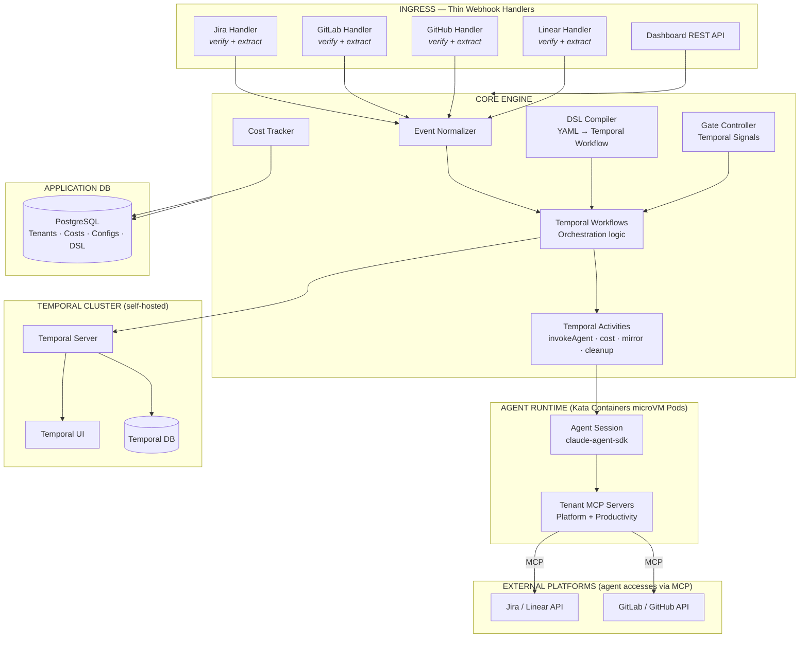

# System Architecture

> Part of [AI SDLC Orchestrator](../overview.md) specification

---

## Three-Layer Architecture

Three layers: **Ingress** (thin webhook handlers) → **Core Engine** (Temporal Workflows + DSL) → **Agent Runtime** (Kata Containers microVM pods running claude-agent-sdk + MCP servers).

Webhooks arrive at the Ingress layer. Each platform has a thin handler (~50-100 lines) that verifies the signature, extracts event type + entity ID, and signals the corresponding Temporal Workflow. The **Core Engine** is expressed entirely as Temporal Workflows (orchestration logic) and Activities (side effects). The only significant Activity is `invokeAgent` — it creates a Kata Containers microVM pod, clones the repo inside it, and starts an agent session. The **agent does everything else**: fetches task details, gathers context, creates branches, implements code, creates MRs, pushes — all via platform MCP servers. Temporal handles all durability, retries, timeouts, and execution history.

### Architecture Diagram



### Supported Platforms

Adding a new platform = adding a thin webhook handler (~50-100 lines) + configuring the platform's MCP server in tenant config. No SDK integration needed.

| Layer | v1 | v2+ |
|---|---|---|
| Task Trackers | Jira Cloud + DC, Linear | YouTrack, ClickUp, GitHub Issues |
| VCS | GitLab CE/EE, GitHub | Bitbucket |
| CI Providers | GitLab CI, GitHub Actions | Jenkins, CircleCI |
| AI Agents | Claude Code (Agent SDK) | OpenHands, Aider |
| Workflow Visibility | Temporal UI (self-hosted) | Custom SaaS dashboard |

---

## Architecture Layers

| Layer | Responsibility |
|---|---|
| **Webhook Handler** | Verify signature, extract event type + entity ID, normalize to `OrchestratorEvent`. ~50 lines per platform |
| **Temporal Workflow** | Orchestration only — calls activities, handles signals, gates, timers. No I/O, no business logic |
| **Temporal Activity** | Side-effect unit. `invokeAgent` (the main one), `updateMirror`, `trackCost`, `cleanupBranch`. Idempotent |
| **AiAgentPort** | The only port in the system — wraps `@anthropic-ai/claude-agent-sdk`. Single `invoke()` method |
| **Agent Sandbox** | Kata Containers microVM pod (KVM isolation) + credential proxy sidecar. Agent does all platform interaction via tenant's MCP servers. Creates branches, MRs, fetches context, transitions statuses |

---

## Project Structure & Monorepo

```
ai-sdlc-orchestrator/
├── apps/
│   ├── orchestrator-api/              # HTTP API (NestJS + Fastify)
│   │                                  # Webhook ingestion, REST API, Temporal client
│   ├── orchestrator-worker/           # Temporal Worker (Workflows + Activities)
│   └── dashboard/                     # SaaS frontend (React + Vite) — v2+
│
├── libs/
│   ├── feature/
│   │   ├── workflow/
│   │   │   ├── main/src/module/
│   │   │   │   ├── temporal/
│   │   │   │   │   ├── workflow/      # Temporal Workflow definitions
│   │   │   │   │   └── activity/      # invokeAgent, costTracking, updateMirror
│   │   │   │   ├── cost-tracking/
│   │   │   │   └── multi-repo/        # Parent–child Workflow coordination
│   │   │   └── shared/src/
│   │   │
│   │   ├── agent/
│   │   │   ├── main/src/module/
│   │   │   │   └── claude-code/       # @anthropic-ai/claude-agent-sdk
│   │   │   └── shared/src/
│   │   │       ├── port/              # AiAgentPort — single invoke() method
│   │   │       ├── sandbox/           # K8s pod client, Kata RuntimeClass config
│   │   │       ├── credential-proxy/  # Proxy config, protocol, sidecar setup
│   │   │       └── type/              # AgentInvocation, AgentResult, AgentToolCall
│   │   │
│   │   ├── webhook/
│   │   │   └── main/src/module/
│   │   │       ├── jira/              # ~50 lines: verify HMAC, extract event
│   │   │       ├── gitlab/            # ~50 lines: verify token, extract event
│   │   │       ├── github/            # ~50 lines: verify HMAC, extract event
│   │   │       └── linear/            # ~50 lines: verify HMAC, extract event
│   │   │
│   │   ├── gate/
│   │   └── tenant/
│   │
│   ├── workflow-dsl/
│   │   └── src/
│   │       ├── schema/                # Zod-validated DSL schema
│   │       ├── compiler/              # YAML → Temporal Workflow
│   │       └── type/
│   │
│   ├── common/
│   │   ├── bootstrap/
│   │   ├── config/
│   │   ├── database/                  # MikroORM setup
│   │   ├── temporal/                  # Temporal client, worker factory
│   │   ├── exception/                 # Result<T,E> / AsyncResult<T,E>
│   │   ├── logger/                    # Pino
│   │   ├── health/
│   │   ├── auth/
│   │   ├── otel/
│   │   └── test/
│   │
│   ├── db/
│   │   └── src/
│   │       ├── entity/                # MikroORM entities (Tenant, TenantMcpServer,
│   │       │                          #   TenantVcsCredential, TenantRepoConfig,
│   │       │                          #   WebhookDelivery, WorkflowMirror,
│   │       │                          #   WorkflowEvent, AgentSession, AgentToolCall,
│   │       │                          #   WorkflowDsl)
│   │       ├── repository/
│   │       └── migration/
│   │
│   └── shared-type/
│
├── docker/
│   ├── Dockerfile.api
│   ├── Dockerfile.worker              # Temporal worker + K8s client (creates Kata pods)
│   ├── Dockerfile.agent               # Git, Node, Python, Go toolchain
│   │                                  # OCI image for agent container in Kata pod
│   ├── Dockerfile.credential-proxy    # Lightweight sidecar — injects VCS PAT + MCP
│   │                                  # tokens into agent requests transparently
│   └── Dockerfile.dashboard
│
├── .helm/
├── docker-compose.dev.yml             # PostgreSQL + Temporal auto-setup + agent Docker container (local dev)
├── nx.json
├── tsconfig.base.json
├── package.json
├── pnpm-workspace.yaml
├── mikro-orm.config.ts
├── CLAUDE.md
└── .ai-orchestrator.yaml
```
