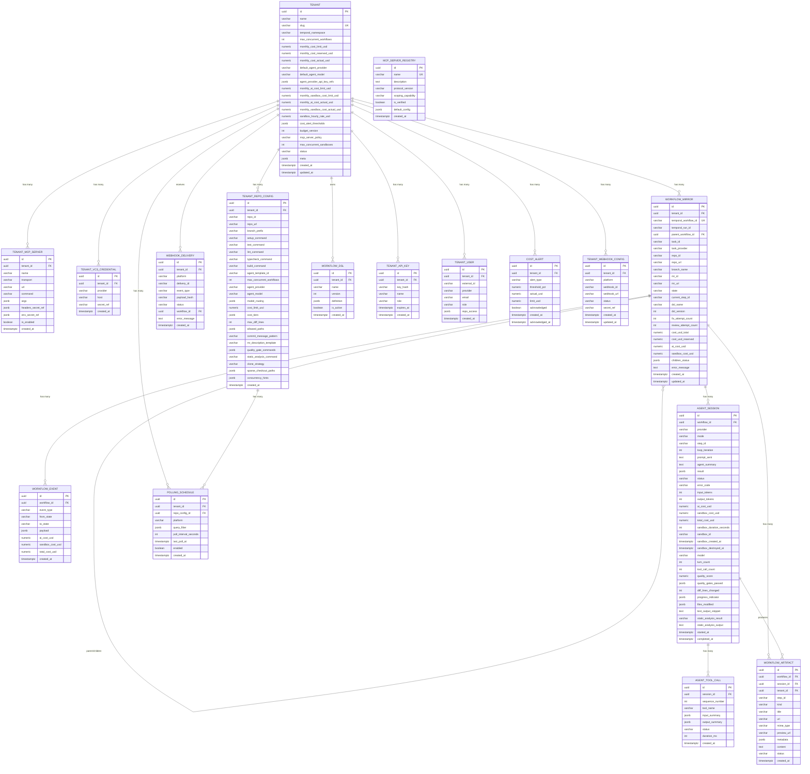

# Data Model

> Part of [Opwerf](../overview.md) specification

---

## Storage Systems

Two distinct storage systems:

**Temporal DB** — managed by Temporal Server, stores all Workflow execution history, activity results, signal queues, timers. Never written to directly by application code.

**App DB (PostgreSQL via MikroORM + RLS)** — tenants, MCP server configs, DSL definitions, cost aggregates, and a `workflow_mirror` table updated by a `updateWorkflowMirror` Activity at each state transition. All tenant-scoped tables enforce Row-Level Security policies keyed on `tenant_id`.

---

## Entity Relationship Diagram

---

## Key Design Decisions

- **`TENANT` normalized** — MCP servers, VCS credentials, and repo configs extracted into dedicated tables. `meta` JSONB retained for truly unstructured data only. Enables querying ("all tenants using GitLab MCP"), per-record CRUD, and change tracking
- **`WEBHOOK_DELIVERY` added** — every incoming webhook persisted for debugging ("why didn't my task trigger?"), audit, and replay. 30-day retention
- **`AGENT_TOOL_CALL` added** — logs every MCP/built-in tool call the agent made. Essential for debugging "why did the agent do X?" without storing the full (massive) conversation history. `input_summary` / `output_summary` are truncated to prevent bloat
- **`AGENT_SESSION.enriched_context_snapshot` removed** — contradicted the agent-first principle (no orchestrator-side context enrichment). Replaced with `agent_summary` (agent-generated summary of what it did) and `mode` (implement / ci_fix / review_fix)
- **`WORKFLOW_MIRROR.dsl_name` + `dsl_version` added** — required for DSL version pinning (replay safety)
- **`WORKFLOW_MIRROR.cost_usd_reserved` added** — supports the budget reservation model (see [Deployment — Budget Reservation & Cost Tracking](deployment.md))
- **`TENANT.monthly_cost_reserved_usd` + `monthly_cost_actual_usd` added** — split tracking for reserved vs actual spend
- **`TENANT_REPO_CONFIG.agent_template_id`** — references the sandbox template for the agent. With E2B backend: an E2B template ID. With Agent Sandbox + Kata backend: a SandboxTemplate CRD name. Enables per-tenant template pinning and canary rollout (see [Sandbox & Security — Template Versioning](sandbox-and-security.md))
- **`TENANT_API_KEY` and `TENANT_USER` added** — supports OIDC authentication, API key management, and RBAC (`admin` / `operator` / `viewer`). API keys stored hashed with bcrypt
- **`AGENT_SESSION.step_id` + `loop_iteration` added** — links each agent session to the DSL step (`implement`, `ci_fix`, `review_fix`) and tracks which iteration of a fix loop the session belongs to
- **`AGENT_SESSION.error_code` added** — structured error classification for retry strategy and analytics. Values: `cancelled`, `cost_limit`, `turn_limit`, `infra_error`, `agent_error`, `max_iterations_exceeded`, `quality_gate_skipped`, `diff_size_exceeded`, `scope_violation`, `prompt_injection_detected`, `no_progress`, `test_regression`, `mr_description_invalid`, `commit_message_invalid`, `static_analysis_failed`
- **Provider abstraction at data level** — `TENANT.default_agent_provider` + `TENANT_REPO_CONFIG.agent_provider` enables per-tenant and per-repo AI provider selection (Claude, OpenHands, Aider). `AGENT_SESSION.provider` records which provider was actually used. `agent_provider_api_key_refs` JSONB stores references to K8s secrets per provider
- **Split cost tracking (AI vs sandbox)** — `ai_cost_usd` and `sandbox_cost_usd` tracked separately throughout: `AGENT_SESSION`, `WORKFLOW_EVENT`, `WORKFLOW_MIRROR`. Enables accurate cost attribution — AI token costs vary by provider/model while sandbox costs are time-based. `TENANT` has separate `monthly_ai_cost_limit_usd` and `monthly_sandbox_cost_limit_usd` caps. Legacy `cost_usd` renamed to `ai_cost_usd` on `AGENT_SESSION`
- **Budget optimistic concurrency** — `TENANT.budget_version` enables optimistic locking for budget reservation instead of `SELECT ... FOR UPDATE`. Multiple concurrent workflows can attempt budget reservations without row-level lock contention. Retry on version conflict
- **Quality scoring** — `AGENT_SESSION.quality_score` (0.0–1.0) is a composite metric combining task completion, quality gate results, efficiency, and progress. `quality_gates_passed` JSONB tracks individual gate results. `diff_lines_changed`, `files_modified`, `progress_indicator` enable trend analysis and adaptive loop decisions
- **Session context for fix loops** — `AGENT_SESSION.test_output_snippet`, `files_modified`, `progress_indicator` provide structured data for constructing `SessionContext` (see [Integration — Agent Prompt & Context Strategy](integration.md)) instead of relying on agent self-reported summaries
- **Static analysis integration** — `TENANT_REPO_CONFIG.static_analysis_command` and `AGENT_SESSION.static_analysis_result`/`static_analysis_output` support configurable static analysis gates (e.g., Semgrep, ESLint security rules)
- **`COST_ALERT` added** — per-tenant cost alerting. Fires when actual spend crosses configurable threshold percentages (`cost_alert_thresholds`) of monthly limits. Separate alerts for AI and sandbox spend (`alert_type`: `'ai'` / `'sandbox'` / `'total'`). Acknowledged flag prevents duplicate notifications
- **`TENANT_WEBHOOK_CONFIG` added** — tracks webhook registrations per platform per tenant. Enables health monitoring ("is our GitLab webhook still active?"), automated re-registration on failure, and multi-platform webhook lifecycle management
- **`POLLING_SCHEDULE` added** — polling fallback for webhook resilience. When webhooks are unreliable or unavailable, per-repo polling schedules query platform APIs on a configurable interval. `query_filter` JSONB holds platform-specific JQL/GraphQL queries
- **`MCP_SERVER_REGISTRY` added** — global curated list of verified MCP servers. `TENANT.mcp_server_policy` controls whether tenants can only use verified servers (`'curated'`) or any server (`'open'`). `scoping_capability` indicates whether the server supports tenant/repo-scoped access (`'full'` / `'partial'` / `'none'`)
- **Webhook resilience entities** — `TENANT_WEBHOOK_CONFIG` + `POLLING_SCHEDULE` together enable the durable ingestion pattern: write-first webhook processing, polling fallback, and periodic reconciliation (see [Deployment — Webhook Resilience](deployment.md))
- **Repo-level quality controls** — `TENANT_REPO_CONFIG` gains `max_diff_lines`, `allowed_paths`, `commit_message_pattern`, `mr_description_template`, `quality_gate_commands` to enforce output quality at the repo level. `cost_tiers` JSONB maps task complexity labels to dollar limits
- **Sparse checkout** — `clone_strategy` now supports `'sparse'` in addition to existing options. `sparse_checkout_paths` JSONB lists directories to include, optimizing clone time for monorepos
- **Concurrency hints** — `TENANT_REPO_CONFIG.concurrency_hints` enables per-repo concurrency tuning: `"auto"` mode uses path isolation to allow concurrent workflows on non-overlapping file paths; `"manual"` mode preserves default serial execution
- **Tenant onboarding** — `TENANT.status` tracks the tenant provisioning lifecycle (Temporal namespace creation, webhook registration, credential setup). See DD-36 for the full lifecycle including offboarding
- **E2B admission control** — `TENANT.max_concurrent_sandboxes` limits parallel sandbox usage per tenant, preventing resource exhaustion and enabling fair multi-tenant scheduling
- **DD-31: MCP protocol version tracking** — `MCP_SERVER_REGISTRY.protocol_version` (default `'2025-03-26'`) records the MCP protocol version supported by each registered server. Enables compatibility checks when connecting agents to MCP servers and supports future protocol upgrades
- **DD-32: Label-based model routing** — `TENANT_REPO_CONFIG.model_routing` enables per-repo cost optimization by routing trivial tasks to cheaper models. Resolution chain: task label → `model_routing` → repo `agent_model` → tenant `default_agent_model` → system default. Example: `{"trivial": "claude-haiku-4-5", "standard": "claude-sonnet-4-6", "complex": "claude-opus-4-6"}`
- **DD-33: Agent-driven workflow artifacts** — `WORKFLOW_ARTIFACT` tracks any deliverable the agent produces at runtime. `kind` is a free-form string (not an enum) so new artifact types require no schema changes — the agent decides what to produce based on the task. `uri` points to the canonical location (MR URL, Figma link, CDN URL, file path in repo). `preview_url` provides a human-reviewable link for non-code artifacts (Figma preview, Storybook deploy, etc.). `metadata` JSONB holds arbitrary structured data (diff stats, coverage %, Figma node IDs). `status` lifecycle: `draft` → `published` → `superseded` (replaced by a newer version) or `rejected` (reviewer rejected). The agent publishes artifacts via the `publish_artifact` built-in tool (see [Integration — Agent Tools](integration.md)). Gate steps can optionally require specific artifact kinds via `require_artifacts` (see [Workflow Engine — Artifact-Aware Gates](workflow-engine.md)). Follows the MCP "tool-mediated artifact" pattern: tools produce artifacts as side effects; the orchestrator tracks references without understanding artifact internals
- **DD-34: Artifact entity indexing** — `WORKFLOW_ARTIFACT` is indexed on `(workflow_id, kind)` for gate validation queries and `(tenant_id, created_at)` for dashboard listing. Partitioned monthly alongside `WORKFLOW_EVENT`. `content` column is optional — large artifacts live externally (VCS, Figma, CDN), only small inline artifacts (JSON configs, summaries) are stored directly
- **DD-35: Scoped RBAC with team-level permissions** — `TENANT_USER.role` provides tenant-wide access (`admin` / `operator` / `viewer`). For enterprises with multiple teams sharing a tenant, `TENANT_USER.repo_access` (JSONB, nullable) adds per-repo permission scoping. When `repo_access` is `null`, the user has access to all repos (current behavior — backward-compatible). When set, it contains an array of `{ repo_id: string, role: 'operator' | 'viewer' }` objects restricting the user's effective role per repo. Example: `[{"repo_id": "backend-api", "role": "operator"}, {"repo_id": "frontend", "role": "viewer"}]`. Tenant-wide `admin` role always has full access regardless of `repo_access`. Gate approvals check `repo_access` — a `viewer` on a repo cannot approve gates for that repo's workflows. API endpoints filter workflow lists and cost dashboards by the user's accessible repos
- **DD-36: Tenant lifecycle and offboarding** — `TENANT.status` tracks the full lifecycle: `pending` → `provisioning` → `active` → `deactivating` → `deactivated` → `deleted`. The existing `onboarding_status` field is superseded by `status` (migration: map `pending`/`provisioning`/`active` to corresponding `status` values, drop `onboarding_status`). State transitions: `deactivating` rejects new workflows and drains active ones (24h grace). `deactivated` retains data for the configurable retention period (default 90 days). `deleted` executes the erasure workflow — see [Deployment — Right-to-Erasure](deployment.md). The `status` field is enforced in webhook handlers (reject if not `active`), workflow starts (reject if not `active`), and API endpoints (read-only if `deactivating`)
- **DD-37: Model validation and deprecation handling** — at workflow start, the resolved model ID (from `model_routing` → `agent_model` → `default_agent_model` → system default) is validated against a `SUPPORTED_MODELS` configuration (Helm values, hot-reloadable via ConfigMap). If the model is **deprecated** (in `SUPPORTED_MODELS` with `status: deprecated`): workflow starts with a warning logged, `WORKFLOW_EVENT` records deprecation notice, dashboard shows tenant notification. If the model is **removed** (not in `SUPPORTED_MODELS`): workflow is rejected with `error_code: model_not_available`, clear error message suggests the successor model. **Bulk migration API**: `POST /admin/models/migrate` accepts `{ from: "old-model-id", to: "new-model-id" }` and updates all `TENANT_REPO_CONFIG.agent_model`, `TENANT_REPO_CONFIG.model_routing` values, and `TENANT.default_agent_model` entries matching the old model. Generates an audit trail of all changes

---

## Workflow Mirror Reconciliation

`workflow_mirror` is a read model updated by the `updateWorkflowMirror` Activity after each state transition. Since it's eventually consistent, the following safeguards apply:

- **Retry policy** — The `updateWorkflowMirror` Activity has aggressive retries (`maximumAttempts: 10`, `initialInterval: 1s`). It's a simple DB upsert, so failures are rare and transient.
- **Periodic reconciliation** — A scheduled job (every 15 min) queries Temporal for open Workflow executions (via Elasticsearch visibility store for efficient queries) and compares against `workflow_mirror`. Stale or missing mirrors are updated by fetching the latest Workflow state via `describeWorkflowExecution`.
- **Staleness indicator** — `workflow_mirror.updated_at` is compared against current time in the dashboard. Mirrors older than 5 minutes for active workflows display a "possibly stale" badge.
- **Cost reservation reconciliation** — Same scheduled job checks for `cost_usd_reserved > 0` on completed/blocked workflows (orphaned reservations from crashed Activities) and releases them back to the tenant's monthly budget. For split cost tracking, both AI and sandbox reserved amounts are reconciled independently.
