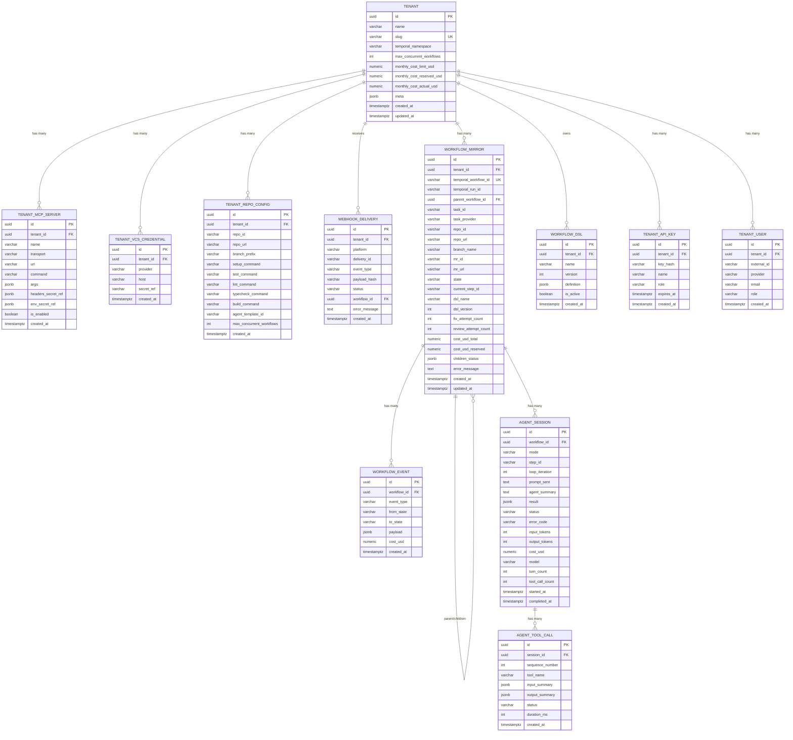

# Data Model

> Part of [AI SDLC Orchestrator](../overview.md) specification

---

## Storage Systems

Two distinct storage systems:

**Temporal DB** — managed by Temporal Server, stores all Workflow execution history, activity results, signal queues, timers. Never written to directly by application code.

**App DB (PostgreSQL via MikroORM)** — tenants, MCP server configs, DSL definitions, cost aggregates, and a `workflow_mirror` table updated by a `updateWorkflowMirror` Activity at each state transition.

---

## Entity Relationship Diagram

---

## Key Design Decisions

- **`TENANT` normalized** — MCP servers, VCS credentials, and repo configs extracted into dedicated tables. `meta` JSONB retained for truly unstructured data only. Enables querying ("all tenants using GitLab MCP"), per-record CRUD, and change tracking
- **`WEBHOOK_DELIVERY` added** — every incoming webhook persisted for debugging ("why didn't my task trigger?"), audit, and replay. 30-day retention
- **`AGENT_TOOL_CALL` added** — logs every MCP/built-in tool call the agent made. Essential for debugging "why did the agent do X?" without storing the full (massive) conversation history. `input_summary` / `output_summary` are truncated to prevent bloat
- **`AGENT_SESSION.enriched_context_snapshot` removed** — contradicted the agent-first principle (no orchestrator-side context enrichment). Replaced with `agent_summary` (agent-generated summary of what it did) and `mode` (implement / ci_fix / review_fix)
- **`WORKFLOW_MIRROR.dsl_name` + `dsl_version` added** — required for DSL version pinning (replay safety)
- **`WORKFLOW_MIRROR.cost_usd_reserved` added** — supports the budget reservation model (see [Deployment — Rate Limiting](deployment.md))
- **`TENANT.monthly_cost_reserved_usd` + `monthly_cost_actual_usd` added** — split tracking for reserved vs actual spend
- **`TENANT_REPO_CONFIG.agent_template_id`** — references the E2B sandbox template ID for the agent. Enables per-tenant template pinning and canary rollout (see [Sandbox & Security — E2B Template Versioning](sandbox-and-security.md))
- **`TENANT_API_KEY` and `TENANT_USER` added** — supports OIDC authentication, API key management, and RBAC (`admin` / `operator` / `viewer`). API keys stored hashed with bcrypt
- **`AGENT_SESSION.step_id` + `loop_iteration` added** — links each agent session to the DSL step (`implement`, `ci_fix`, `review_fix`) and tracks which iteration of a fix loop the session belongs to
- **`AGENT_SESSION.error_code` added** — structured error classification (`cancelled`, `cost_limit`, `turn_limit`, `infra_error`, `agent_error`) for retry strategy and analytics

---

## Workflow Mirror Reconciliation

`workflow_mirror` is a read model updated by the `updateWorkflowMirror` Activity after each state transition. Since it's eventually consistent, the following safeguards apply:

- **Retry policy** — The `updateWorkflowMirror` Activity has aggressive retries (`maximumAttempts: 10`, `initialInterval: 1s`). It's a simple DB upsert, so failures are rare and transient.
- **Periodic reconciliation** — A scheduled job (every 15 min) queries Temporal for open Workflow executions (via Elasticsearch visibility store for efficient queries) and compares against `workflow_mirror`. Stale or missing mirrors are updated by fetching the latest Workflow state via `describeWorkflowExecution`.
- **Staleness indicator** — `workflow_mirror.updated_at` is compared against current time in the dashboard. Mirrors older than 5 minutes for active workflows display a "possibly stale" badge.
- **Cost reservation reconciliation** — Same scheduled job checks for `cost_usd_reserved > 0` on completed/blocked workflows (orphaned reservations from crashed Activities) and releases them back to the tenant's monthly budget.
