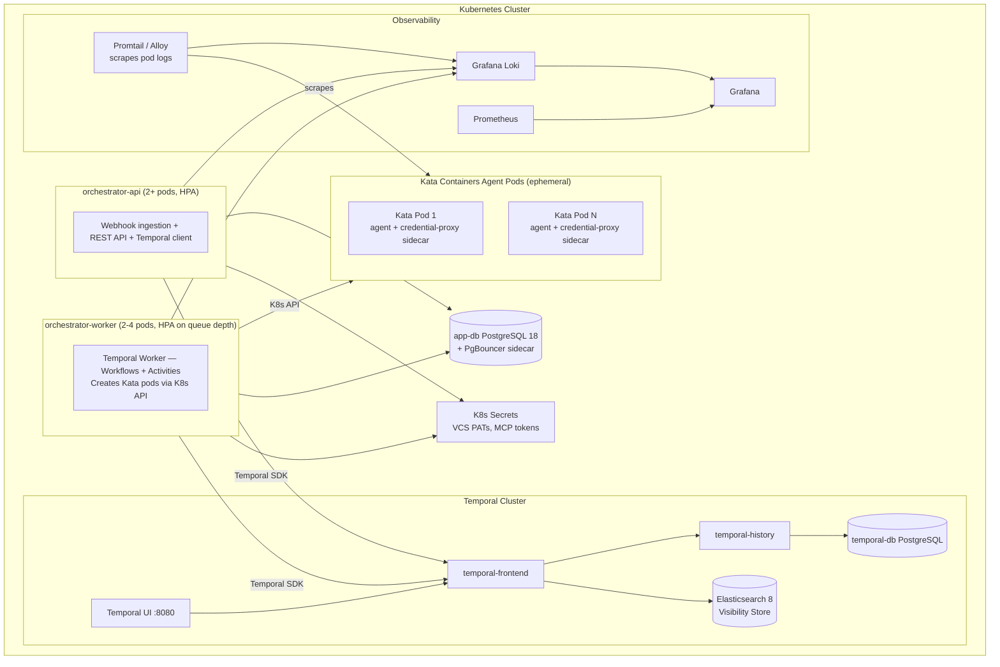

# Deployment

> Part of [AI SDLC Orchestrator](../overview.md) specification

---

## Configuration & Registry

| Config Section | Key Settings |
|---|---|
| **Webhooks** | Per-platform: webhook secret for signature verification. That's all the orchestrator needs per platform |
| **VCS Credentials** | PAT for `git clone` / `git push` (injected via `GIT_ASKPASS`, never in URLs) |
| **AI Agent** | Model, API key ref, max turns, max fix iterations, cost limit per task (USD) |
| **MCP Servers** | Per-tenant list of MCP servers to inject into agent session (platform + productivity + custom). This is the primary integration config |
| **Workflow DSL** | Path to workflow YAML or stored in app DB per tenant. Gate conditions per label/priority/project |
| **Temporal** | Server address, namespace, task queue, worker concurrency. For cluster-wide connection limit management with >4 total API+Worker pods, a centralized PgBouncer deployment (K8s Service) is recommended |
| **Repo Config** | Per-repo: setup, test, lint, typecheck, build commands, branch prefix (`ai/`), agent image tag |

All config validated at startup via Zod. Secrets referenced as `k8s://secret/{name}`, never in config files or Workflow inputs.

### Rate Limiting & Concurrency Controls

| Control | Default | Scope | Mechanism |
|---|---|---|---|
| **Webhook ingress** | 100 req/s per tenant | API gateway | NestJS `@nestjs/throttler` or K8s Ingress rate limit annotation |
| **Concurrent workflows per tenant** | 10 | Temporal | Checked before `startWorkflow` — query `workflow_mirror` for active count. Combined with Temporal's `startWorkflow` idempotency (deterministic workflow ID) and a `SELECT ... FOR UPDATE` on the tenant's concurrent workflow counter for authoritative check |
| **Concurrent workflows per repo** | 1 | Temporal | Serializes AI work on the same repo to prevent merge conflicts. Workflow ID includes repo slug — Temporal's "workflow ID reuse policy" prevents concurrent starts. Additional workflows queue as pending (signaled when the current one completes). Configurable per tenant (increase for repos with independent modules) |
| **Concurrent agent pods per worker** | 2 | Worker config | Temporal Worker `maxConcurrentActivityTaskExecutions`. Each Kata pod: repo clone + `npm ci` + build + agent process = 4-8 GB RAM. Size K8s nodes with sufficient resources for Kata VM overhead |
| **External API rate limits** | Adaptive | MCP / Temporal | MCP servers handle platform rate limits internally. Temporal Activity retry policy for agent invocation: `initialInterval: 5s`, `backoffCoefficient: 2`, `maximumInterval: 60s`, `maximumAttempts: 5` |
| **Cost cap per task** | $5 USD | Agent SDK | `costLimitUsd` passed to agent session. Agent SDK terminates session when exceeded |
| **Cost cap per tenant/month** | $500 USD | Orchestrator | **Budget reservation model:** when a workflow starts, the per-task cost cap ($5) is reserved (decremented from remaining budget). If the session costs less, the surplus is released. If monthly budget minus reservations < per-task cap, new workflows are rejected. Prevents concurrent workflows from overshooting the monthly cap. Budget check and reservation use `SELECT ... FOR UPDATE` on the `TENANT` row to serialize concurrent reservation attempts within a single database transaction |

### Temporal Namespace Strategy

**One namespace per tenant.** This provides:
- **Query isolation** — `listWorkflowExecutions` scoped to tenant without filters
- **Independent retention** — per-tenant history retention policy
- **Rate limit isolation** — one tenant's burst doesn't starve others
- **Simpler RBAC** — Temporal namespace-level permissions map to tenant access

Trade-off: more namespaces to manage. Mitigated by automating namespace creation in the tenant onboarding flow. For self-hosted deployments with few tenants (<10), a single namespace with tenant ID in Workflow IDs is acceptable.

---

## Deployment Topology

Six components: **orchestrator-api**, **orchestrator-worker** (Temporal Worker), **Kata Containers agent pods** (ephemeral, per-session), **Temporal cluster** (self-hosted + Elasticsearch for visibility), **App DB** (PostgreSQL + PgBouncer), **Observability** (Loki + Prometheus + Grafana).

---

## Repo Clone Strategy (per Activity execution)

1. Worker receives `invokeAgent` Activity task from Temporal
2. Creates **Kata pod** via K8s API:
   - `runtimeClassName: kata-containers`
   - Agent container from OCI image (`Dockerfile.agent`): pre-baked toolchain (Git, Node.js, Python, Go) + agent SDK
   - Credential-proxy sidecar from OCI image (`Dockerfile.credential-proxy`): K8s Secret mounted (VCS PAT + MCP tokens)
   - Resource limits (CPU, memory, ephemeral storage) configured per tenant
   - K8s NetworkPolicy: egress allowlist configured per tenant namespace
3. Inside agent container:
   - `GIT_ASKPASS` configured to call credential proxy sidecar at `localhost:9999` — git clone authenticates transparently without the agent ever seeing the PAT
   - `git clone --shallow-since="30 days ago" --single-branch --branch {target}` to `/workspace`
   - Fallback: if shallow clone produces an empty repo (no commits in last 30 days), retry with `--depth=1` (latest commit only). `TENANT_REPO_CONFIG` supports a `clone_strategy` override (`shallow_30d` | `depth_1` | `full`) for repos requiring full history
   - For fix loops: `git checkout {existing-branch}`
   - Loads repo config (`.ai-orchestrator.yaml` → tenant settings → auto-detect)
   - Runs **setup command** (`npm ci`, `pip install`, etc.)
   - Builds agent prompt (task ID, repo info, workflow instructions, previous session summary if fix loop)
   - Passes tenant's MCP server configs to Agent SDK
   - Starts agent session — agent autonomously: fetches task, gathers context, creates branch, implements, tests, pushes, creates MR
4. Activity monitors pod, heartbeats to Temporal every 30s with agent phase
5. **Graceful shutdown:** at T-5min before `startToCloseTimeout`, the Activity writes a sentinel file `/workspace/.shutdown-requested` via `kubectl exec touch`. The agent's system prompt instructs: "Between tool calls, check if `/workspace/.shutdown-requested` exists. If present, commit and push partial work immediately, then exit." The Activity waits up to 2 min for graceful completion. If the agent does not exit, the Activity deletes the pod (SIGKILL via K8s)
6. Pod completes → Activity reads `AgentResult` from pod logs / exit status
7. **Verify agent output** (see Agent Output Verification below)
8. Pod deleted (K8s garbage collection — no persistent state between sessions)
9. Returns verified `AgentResult` to Temporal Workflow (includes `summary`, `toolCalls`, cost data)

### Agent Output Verification

The `invokeAgent` Activity does not blindly trust `AgentResult`. After the agent reports success, the Activity verifies critical claims before returning to the Workflow:

| Claim | Verification | On Failure |
|---|---|---|
| `branchName` exists | `git ls-remote --heads {repoUrl} {branchName}` via credential proxy | Set `status: 'failure'`, `error: 'branch_not_found'` |
| `mrUrl` is valid | VCS API call (`GET /merge_requests/:id` or `GET /pulls/:id`) via credential proxy | Set `status: 'failure'`, `error: 'mr_not_found'` |
| Commits were pushed | Compare remote branch HEAD with pre-session HEAD | If unchanged, set `status: 'failure'`, `error: 'no_commits_pushed'` |

**Why this matters:** A hallucinating agent could report `status: 'success'` with a plausible-looking `mrUrl` without having actually pushed code or created an MR. Without verification, the Workflow transitions to `CI_WATCH` and waits for a pipeline that will never run — stuck silently until the 2-hour `ci_watch` timeout.

Verification adds ~1-2 seconds per session (two API calls) and prevents silent failures. The credential proxy handles authentication for these verification calls.

---

## Retry Strategy (Error-Type Differentiation)

Not all `invokeAgent` failures are retryable. The Activity inspects `AgentResult.status` and the failure mode to decide:

| Failure Type | `AgentResult.status` | Retryable? | Action |
|---|---|---|---|
| **Infrastructure error** (pod OOM, pod scheduling failure, network failure) | Activity throws `ApplicationFailure` (non-agent error) | **Yes** | Temporal retries with backoff (`initialInterval: 30s`, `backoffCoefficient: 2`, `maximumAttempts: 3`) |
| **Agent logic error** (bad code, wrong approach, tests fail repeatedly) | `failure` | **No** | Return to Workflow immediately → BLOCKED. Retrying wastes money with the same result |
| **Cost limit exceeded** | `cost_limit` | **No** | Return to Workflow → BLOCKED. Agent consumed the budget |
| **Turn limit exceeded** | `turn_limit` | **No** | Return to Workflow → BLOCKED. Task is too complex for current limits |
| **Verification failed** (branch/MR not found) | `failure` + verification error | **Retry once** | Could be a timing issue (VCS propagation delay). Retry once after 10s. If still fails → BLOCKED |

The Activity wraps non-retryable failures in Temporal's `ApplicationFailure` with `nonRetryable: true` to prevent Temporal from retrying automatically.

---

## Local Development (Sandbox Strategy)

Kata Containers requires KVM support and a K8s cluster, which is not available on a developer's laptop. The local dev strategy uses a layered approach:

| Dev Scenario | Sandbox Strategy | What It Tests |
|---|---|---|
| **Unit / Component tests** | No sandbox — mock K8s client | Business logic, DSL compilation, cost tracking, webhook handling |
| **Temporal Workflow tests** | No sandbox — `TestWorkflowEnvironment` with mocked `invokeAgent` Activity | State transitions, signal handling, gates, loops, multi-repo |
| **Agent integration (local)** | **Docker container fallback** — `invokeAgent` Activity detects `SANDBOX_MODE=docker` and runs the agent in a local Docker container instead of a Kata pod | Agent prompt construction, `AgentResult` parsing, credential proxy protocol. Weaker isolation but functional for development |
| **Sandbox integration (CI)** | **Kata on dev K8s cluster** — CI runs against a K8s cluster with Kata Containers installed | Real KVM isolation, credential proxy sidecar, network restrictions, image validation |
| **Full E2E (staging)** | **Production-equivalent K8s + Kata** | Everything |

**Docker fallback implementation:**
- `invokeAgent` Activity has a `SANDBOX_MODE` config: `kata` (production) or `docker` (local dev)
- In `docker` mode, the Activity runs `Dockerfile.agent` as a local Docker container with the same setup sequence (start proxy sidecar, clone, install, run agent)
- Docker mode skips network restrictions and uses container-level process isolation (weaker than Kata but sufficient for development)
- **Docker mode is never used in production** — enforced by config validation at startup

`docker-compose.dev.yml` includes: PostgreSQL, PgBouncer, Temporal (server + UI + Elasticsearch), and a pre-built agent container image for Docker fallback mode.

---

## Healthcheck Endpoints

| Endpoint | Component | Checks |
|---|---|---|
| `GET /health/live` | API | Process alive (always 200 if server is running) |
| `GET /health/ready` | API | PostgreSQL connectivity + Temporal connection |
| `GET /health/live` | Worker | Process alive |
| `GET /health/ready` | Worker | PostgreSQL connectivity + Temporal connection + K8s API access (can create pods) + container registry reachable (can pull agent images) |

Both API and Worker expose these for K8s liveness and readiness probes. Readiness probe failure removes the pod from the Service/TaskQueue without killing it — allows in-flight requests/activities to complete.

---

## Authentication & Authorization

| Component | Mechanism |
|---|---|
| **Dashboard UI** | OIDC (Google / GitHub / custom IdP). Session cookies with CSRF protection |
| **REST API (programmatic)** | API key per tenant, passed via `Authorization: Bearer <key>` header. Keys stored hashed in `TENANT` table |
| **Webhook endpoints** | Per-platform signature verification (HMAC). No auth token — webhooks are verified by signature |
| **Gate approval API** | Authenticated via dashboard session or API key. RBAC: `admin` (full access), `operator` (approve gates, view workflows), `viewer` (read-only) |
| **Temporal UI** | Proxied through API with same auth. Scoped to tenant's namespace |

### Worker Service Account RBAC

The Worker ServiceAccount follows least-privilege principles with per-namespace Roles (not ClusterRoles):

| Namespace | Role | Permissions |
|---|---|---|
| Tenant namespace (one per tenant) | `agent-pod-manager` | `create`, `get`, `delete` pods; `get` secrets (specific secret names only) |
| System namespace | `temporal-worker` | Connect to Temporal, read ConfigMaps |

- Worker ServiceAccount has RoleBindings in each tenant namespace — cannot create pods or read secrets outside tenant namespaces
- Namespace creation and RoleBinding setup is automated as part of tenant onboarding
- Worker cannot list all pods cluster-wide — only in namespaces it has explicit RoleBindings for

### Encryption in Transit

All intra-cluster communication uses TLS:
- **Temporal:** mTLS between workers and Temporal frontend (built-in Temporal feature)
- **PostgreSQL:** `sslmode=require` on all database connections
- **K8s API:** TLS by default
- **Credential proxy ↔ agent:** localhost only (no network transit — same pod network namespace)

For zero-trust environments, a service mesh (Istio/Linkerd) provides automatic mTLS between all pods.

---

## Monitoring & Alerting

**Application metrics (Prometheus + Grafana):**

| Metric | Type | Alert Threshold |
|---|---|---|
| `orchestrator_workflows_active` | Gauge (per tenant) | > 50 per tenant |
| `orchestrator_workflow_duration_seconds` | Histogram | p95 > 30 min |
| `orchestrator_agent_cost_usd` | Counter (per tenant) | Monthly budget > 80% |
| `orchestrator_agent_cost_reserved_usd` | Gauge (per tenant) | Reserved > 90% of monthly budget |
| `orchestrator_ci_fix_iterations` | Histogram | p95 > 2 (agent struggling) |
| `orchestrator_webhook_ingress_total` | Counter | Spike > 10x baseline |
| `orchestrator_webhook_invalid_total` | Counter | > 10/hour (misconfigured webhook) |
| `orchestrator_workflow_blocked_total` | Counter | > 5/hour (systemic issue) |
| `orchestrator_agent_pod_oom_killed_total` | Counter | > 0 (increase pod memory limits) |
| `orchestrator_repo_per_concurrency_queued` | Gauge (per repo) | > 3 (repo bottleneck) |

**Kata pod metrics (emitted by `invokeAgent` Activity + K8s metrics):**

| Metric | Type | Alert Threshold |
|---|---|---|
| `orchestrator_pod_creation_duration_seconds` | Histogram | p95 > 10s (scheduling issue or Kata startup delay) |
| `orchestrator_pod_creation_failed_total` | Counter | > 3/hour (K8s scheduling issues, insufficient resources) |
| `orchestrator_pod_active` | Gauge | > 80% of node capacity |
| `orchestrator_pod_duration_seconds` | Histogram | p95 > 45 min (sessions running long) |
| `orchestrator_agent_image_tag` | Info (per pod) | — (for tracking image rollouts) |

**Temporal-specific metrics (Temporal SDK exposes to Prometheus):**

| Metric | Alert Threshold |
|---|---|
| `temporal_workflow_task_schedule_to_start_latency` | p95 > 5s (workers overloaded) |
| `temporal_activity_schedule_to_start_latency` | p95 > 30s (need more workers) |
| `temporal_activity_execution_failed` | > 10/min |
| `temporal_workflow_task_queue_backlog` | > 100 (scale workers) |
| Worker pod CPU/memory | > 80% sustained (HPA trigger) |

**Distributed tracing:** OpenTelemetry SDK (already in tech stack) exports traces to Grafana Tempo. Trace context propagated: API pod → Temporal SDK → Activity → K8s API calls → agent pod (via `TRACEPARENT` env var in pod spec). Enables end-to-end latency analysis across the full webhook → workflow → agent pipeline.

**Log flush guarantee:** The Activity waits 5 seconds after pod completion before deleting the pod, allowing Promtail/Alloy to scrape final log lines. For critical sessions, the Activity reads the last 100 log lines via `kubectl logs` as a fallback before pod deletion.

---

## Backup & Disaster Recovery

| Component | Strategy | RPO | RTO |
|---|---|---|---|
| **App DB (PostgreSQL)** | Daily automated backups (pg_dump) + continuous WAL archiving to object storage | < 5 min (WAL) | < 30 min (restore from backup) |
| **Temporal DB** | Same as App DB — separate PostgreSQL instance with its own backup schedule | < 5 min | < 30 min |
| **Temporal Workflows** | Durable by design — Temporal replays from event history. After DB restore, all in-flight workflows resume automatically | 0 (event-sourced) | Equal to DB RTO |
| **Worker state** | Stateless — no persistent data on workers. Agent sessions can be retried by Temporal after worker loss | N/A | Immediate (Temporal reschedules) |
| **Kata pods** | Ephemeral — pods are created per session and deleted on completion. No backup needed. If a pod is lost, Temporal retries the Activity and creates a new pod | N/A (stateless) | Immediate (Temporal reschedules) |
| **Elasticsearch (Temporal visibility)** | Snapshot to object storage (daily). Temporal can rebuild visibility from event history if needed | < 24h (snapshot) | < 1h (restore from snapshot) or rebuild from Temporal DB |
| **Configuration** | Stored in App DB (backed up) + Helm values in Git | 0 (Git) | < 5 min (Helm rollback) |

**Disaster scenarios:**
- **Worker pod dies mid-agent-session** → Temporal detects via heartbeat timeout (90s), reschedules Activity to another worker. Orphaned Kata pod is cleaned up by K8s garbage collection (pod TTL or Activity cleanup on retry)
- **K8s node failure** → Kata pods on that node are lost. Temporal retries the Activity, which creates new pods on healthy nodes. All other orchestrator functions (webhooks, cost tracking, gates) continue normally
- **App DB down** → API returns 503, workers queue retries. Temporal continues independently (separate DB). Restore from backup
- **Temporal DB down** → All workflows pause. After restore, Temporal replays event history and workflows resume from last checkpoint
- **Full cluster failure** → Restore both DBs from backup, redeploy via Helm, Temporal replays all in-flight workflows. Kata pods are recreated automatically by retried Activities

**Post-restore reconciliation:** After Temporal DB restore, a reconciliation job queries all open Workflow executions and compares with external state (branch existence via `git ls-remote`, MR status via VCS API). Workflows referencing non-existent branches or already-merged MRs are transitioned to DONE or BLOCKED accordingly.
