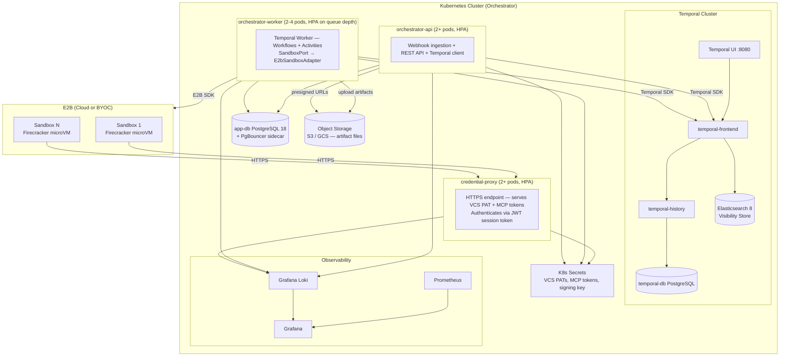
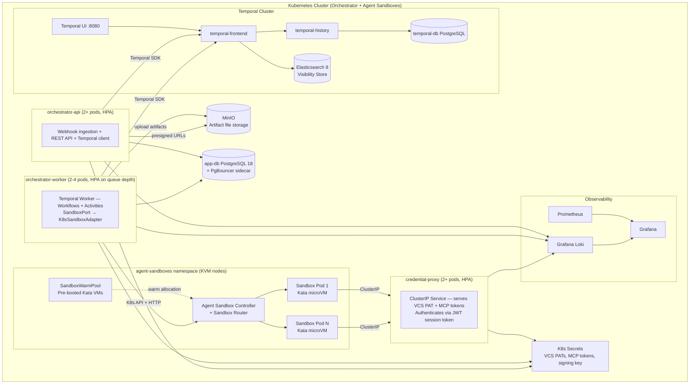

# Deployment

> Part of [AI SDLC Orchestrator](../overview.md) specification

---

## Configuration & Registry

| Config Section | Key Settings |
|---|---|
| **Webhooks** | Per-platform: webhook secret for signature verification. That's all the orchestrator needs per platform |
| **VCS Credentials** | PAT for `git clone` / `git push` (injected via `GIT_ASKPASS`, never in URLs) |
| **AI Agent** | Provider (`anthropic`, `openai`, `ollama`, etc.), model, provider API key ref — resolved per-repo or per-tenant via `TENANT_REPO_CONFIG.agent_provider` / `TENANT.default_agent_provider`. Max turns, max fix iterations, cost limit per task (USD) |
| **Sandbox** | Backend selection (`e2b` or `k8s-agent-sandbox`). E2B: API key, domain, default template ID, sandbox timeout. Agent Sandbox + Kata: namespace, template name, runtime class, warm pool size, router URL. See [Sandbox & Security — Configuration](sandbox-and-security.md) |
| **Credential Proxy** | Ingress URL, session token signing key ref, rate limits |
| **MCP Servers** | Per-tenant list of MCP servers to inject into agent session (platform + productivity + custom). This is the primary integration config |
| **Workflow DSL** | Path to workflow YAML or stored in app DB per tenant. Gate conditions per label/priority/project |
| **Temporal** | Server address, namespace, task queue, worker concurrency. For cluster-wide connection limit management with >4 total API+Worker pods, a centralized PgBouncer deployment (K8s Service) is recommended |
| **Repo Config** | Per-repo: setup, test, lint, typecheck, build commands, branch prefix (`ai/`), agent template ID (E2B template ID or SandboxTemplate CRD name) |
| **Artifacts** | Agent-produced artifacts tracked in `WORKFLOW_ARTIFACT` (PostgreSQL — metadata, URIs, small inline content only). Sandbox-local files (images, reports, build outputs) uploaded to **object storage** before sandbox destruction. External artifacts (MR URLs, Figma links) need no upload |
| **Object Storage** | S3 (SaaS/AWS), GCS (GCP), or MinIO (self-hosted). Bucket: `{tenant-slug}/artifacts/{workflow-id}/{artifact-id}/{filename}`. Presigned URLs for reviewer access (1h TTL). Lifecycle policy: 90 days default, configurable per tenant. See [Integration — Artifact Publishing](../specs/integration.md) |

All config validated at startup via Zod. Secrets referenced as `k8s://secret/{name}`, never in config files or Workflow inputs.

### Rate Limiting & Concurrency Controls

#### Tier-Based Concurrency Limits

| Limit | Standard | Premium | Enterprise | Scope |
|-------|----------|---------|------------|-------|
| Concurrent workflows | 10 | 25 | 50 | Per tenant |
| Concurrent sandboxes | 5 | 15 | 30 | Per tenant |
| Webhook ingestion | 60 req/min | 120 req/min | 300 req/min | Per tenant |
| API requests | 100 req/min | 300 req/min | 1000 req/min | Per tenant |

**Queue Management**:
- Pending workflows timeout after 1 hour (configurable via `TENANT.workflow_queue_ttl`)
- Queue priority: round-robin across tenants (prevents single tenant from monopolizing), FIFO within each tenant
- Queue depth alert: fires when any tenant exceeds 5 pending workflows

#### Additional Controls

| Control | Default | Scope | Mechanism |
|---|---|---|---|
| **Concurrent workflows per repo** | 1 | Temporal | Serializes AI work on the same repo to prevent merge conflicts. Workflow ID includes repo slug — Temporal's "workflow ID reuse policy" prevents concurrent starts. Additional workflows queue as pending (signaled when the current one completes). Configurable per tenant (increase for repos with independent modules) |
| **Concurrent agent sandboxes per worker** | 2 | Worker config | Temporal Worker `maxConcurrentActivityTaskExecutions`. Each sandbox runs externally (E2B) or as a separate pod (Agent Sandbox) — worker resources needed only for monitoring + heartbeating, not for the agent process itself |
| **External API rate limits** | Adaptive | MCP / Temporal | MCP servers handle platform rate limits internally. Temporal Activity retry policy for agent invocation: `initialInterval: 5s`, `backoffCoefficient: 2`, `maximumInterval: 60s`, `maximumAttempts: 5` |
| **Cost cap per task** | $5 USD | Agent SDK | Configurable per-repo via `TENANT_REPO_CONFIG.cost_limit_usd` or `cost_tiers` (e.g., "trivial" = $1, "large" = $15). `costLimitUsd` passed to agent session. Agent SDK terminates session when exceeded |
| **Cost cap per tenant/month** | $500 USD | Orchestrator | Separate limits for AI spend (`TENANT.monthly_ai_cost_limit_usd`) and sandbox spend (`TENANT.monthly_sandbox_cost_limit_usd`). **Budget reservation model:** when a workflow starts, estimated task cost is reserved via optimistic concurrency (see Budget Reservation below). If monthly budget minus reservations < estimated task cap, new workflows are rejected. Prevents concurrent workflows from overshooting the monthly cap |
| **Per-tenant credential proxy rate** | 1000 req/hr per session | Credential Proxy | Exceeding triggers anomaly detection alert. Protects against compromised agent sessions making excessive credential requests |

### Budget Reservation & Cost Tracking

#### Composite Cost Model

Total cost per agent session = **AI cost** (token-based, varies by provider/model) + **Sandbox cost** (time-based, E2B hourly rate).

Both components are tracked separately throughout the system:
- `AGENT_SESSION.ai_cost_usd` + `AGENT_SESSION.sandbox_cost_usd` → `AGENT_SESSION.total_cost_usd`
- `WORKFLOW_EVENT.ai_cost_usd` + `WORKFLOW_EVENT.sandbox_cost_usd` → `WORKFLOW_EVENT.total_cost_usd`
- `WORKFLOW_MIRROR.ai_cost_usd` + `WORKFLOW_MIRROR.sandbox_cost_usd` (running totals)

#### Budget Reservation with Optimistic Concurrency

Instead of `SELECT ... FOR UPDATE` (row-level lock), budget reservation uses optimistic concurrency via `TENANT.budget_version`:

1. Read current `monthly_cost_actual_usd`, `monthly_cost_reserved_usd`, `budget_version`
2. Check: `actual + reserved + estimated_task_cost <= monthly_cost_limit_usd`
3. Update: `SET monthly_cost_reserved_usd = reserved + estimated_task_cost, budget_version = budget_version + 1 WHERE budget_version = :read_version`
4. If update affects 0 rows → version conflict → retry (up to 3 times with jitter)

This eliminates lock contention when multiple workflows start concurrently.

#### Three-Level Budget Check

Before invoking an agent, the orchestrator checks (in order):

1. **Per-task limit** — `TENANT_REPO_CONFIG.cost_limit_usd` or `cost_tiers[taskLabel]` (e.g., "trivial" = $1, "large" = $15)
2. **Per-tenant monthly limit** — `TENANT.monthly_ai_cost_limit_usd` + `TENANT.monthly_sandbox_cost_limit_usd` (checked separately)
3. **System-wide limit** — global safety cap (configurable, default $10,000/month across all tenants)

If any check fails → workflow transitions to `ai_blocked` with `error_code: cost_limit`.

#### Cost Settlement

After an agent session completes:
1. Actual `ai_cost_usd` (from provider response) and `sandbox_cost_usd` (from E2B session duration × `sandbox_hourly_rate_usd`) are recorded
2. Reserved amount is released: `monthly_cost_reserved_usd -= estimated_task_cost`
3. Actual amount is added: `monthly_cost_actual_usd += total_cost_usd`, `monthly_ai_cost_actual_usd += ai_cost_usd`, `monthly_sandbox_cost_actual_usd += sandbox_cost_usd`
4. `budget_version` incremented

#### Orphaned Reservation Recovery

If a workflow crashes mid-execution (Activity timeout, worker crash), the periodic reconciliation job (see [Data Model — Workflow Mirror Reconciliation](data-model.md)) detects orphaned reservations:
- `WORKFLOW_MIRROR.cost_usd_reserved > 0` on completed/blocked/timed-out workflows
- Reservation released back to tenant budget
- If `AGENT_SESSION.sandbox_id` is available, E2B API is queried for actual sandbox runtime to record accurate `sandbox_cost_usd` even for crashed sessions

### Cost Alerting

Configurable per-tenant thresholds trigger alerts when spend approaches limits:

- **Thresholds** — `TENANT.cost_alert_thresholds` (default: `[0.5, 0.8, 0.9, 0.95]`) — percentage of monthly limit
- **Per-category alerts** — separate alerts for AI spend (`monthly_ai_cost_actual_usd / monthly_ai_cost_limit_usd`) and sandbox spend, plus total
- **Alert lifecycle** — when actual spend crosses a threshold, a `COST_ALERT` record is created. Alert is one-shot per threshold per month (acknowledged flag prevents duplicates). Reset at month boundary.
- **Notification** — dashboard shows alert banner, SSE push to connected clients. Future: webhook callback to tenant's monitoring system.
- **Hard stop** — at 100% of limit, new workflows are rejected (`error_code: cost_limit`). In-progress workflows are allowed to complete their current agent session but cannot start new ones.

### Temporal Namespace Strategy

**One namespace per tenant.** This provides:
- **Query isolation** — `listWorkflowExecutions` scoped to tenant without filters
- **Independent retention** — per-tenant history retention policy
- **Rate limit isolation** — one tenant's burst doesn't starve others
- **Simpler RBAC** — Temporal namespace-level permissions map to tenant access

Trade-off: more namespaces to manage. Mitigated by automating namespace creation in the tenant onboarding flow. For self-hosted deployments with few tenants (<10), a single namespace with tenant ID in Workflow IDs is acceptable.

### Temporal Cloud Option

```yaml
temporal:
  mode: 'cloud'  # or 'self-hosted'
  cloud:
    namespace: 'prod.xxxxx'
    address: 'prod.xxxxx.tmprl.cloud:7233'
    tls:
      certPath: /etc/temporal/tls/client.pem
      keyPath: /etc/temporal/tls/client.key
```

| Aspect | Self-Hosted | Temporal Cloud |
|--------|------------|----------------|
| Operational overhead | High (cluster, persistence, Elasticsearch) | Minimal (managed) |
| Cost | Infrastructure + ops team time | ~$200–500/mo (usage-based) |
| Visibility (advanced search) | Requires Elasticsearch | Built-in |
| Air-gap / regulated | Supported | Not available |
| Recommended for | Banking, regulated, air-gapped | SaaS, small teams, startups |

When `temporal.mode: 'cloud'`, the following components are **not deployed**: Temporal server pods, Temporal UI, Elasticsearch, dedicated Temporal PostgreSQL database.

### Global Sandbox Backpressure

Per-tenant sandbox limits prevent individual abuse, but the system also needs a global cap to protect infrastructure:

| Setting | Default | Description |
|---------|---------|-------------|
| `SYSTEM_CONFIG.max_global_sandboxes` | 100 | Maximum concurrent sandboxes across all tenants |
| `SYSTEM_CONFIG.sandbox_queue_ttl` | `1h` | Maximum time a workflow waits for sandbox capacity |

**Admission Control**: Before creating a sandbox, the `createSandbox` Activity checks the global count. If at capacity:
1. Temporal Activity retries with exponential backoff (natural queue behavior)
2. Tenant priority determines retry priority: `premium` tenants retry before `standard`
3. After `sandbox_queue_ttl`, the workflow transitions to `BLOCKED` with reason `sandbox_capacity_exhausted`

**Tenant Priority Tiers**:
- `standard`: best-effort sandbox allocation, lower retry priority
- `premium`: guaranteed capacity (reserved pool), higher retry priority

**Metrics**:
- `orchestrator_sandbox_active_total` gauge (labels: `tenant_id`, `provider`)
- `orchestrator_sandbox_queue_depth` gauge (labels: `priority_tier`)
- `orchestrator_sandbox_queue_wait_seconds` histogram

### Tenant QoS Tiers

| Capability | Standard | Premium | Dedicated |
|------------|----------|---------|-----------|
| Worker pool | Shared | Shared (priority queue) | Isolated worker pool |
| Credential proxy | Shared replicas | Shared replicas | Dedicated replica set |
| PgBouncer | Shared pool | Dedicated user pool | Dedicated user pool |
| Max concurrent workflows | 10 | 25 | 50 |
| Max concurrent sandboxes | 5 | 15 | 30 |
| Sandbox queue priority | Best-effort | Priority retry | Guaranteed capacity |
| Support SLA | Best-effort | 4h response | 1h response |

**PgBouncer per-tenant pools**: Each premium/dedicated tenant gets a dedicated PgBouncer user pool, preventing connection starvation from noisy neighbors. Standard tenants share a common pool with per-tenant connection limits.

**Worker pool isolation** (dedicated tier): Temporal task queue per tenant (`workflow-{tenant_id}`), backed by dedicated worker pods with resource guarantees.

---

## Deployment Topology

Core components: **orchestrator-api**, **orchestrator-worker** (Temporal Worker), **credential-proxy** (standalone service), **agent sandboxes** (E2B or Agent Sandbox + Kata — selected per deployment model via `SandboxPort`), **Temporal cluster** (self-hosted + Elasticsearch for visibility), **App DB** (PostgreSQL + PgBouncer), **Object Storage** (S3 / GCS / MinIO — artifact file uploads), **Observability** (Loki + Prometheus + Grafana).

The orchestrator runs in K8s. Agent sandboxes run either externally (E2B Cloud/BYOC) or in the same K8s cluster (Agent Sandbox + Kata). All sandbox interaction goes through `SandboxPort` — the worker code is backend-agnostic.

### SaaS Deployment (E2B Backend)



### Credential Proxy Sizing

**Credential Proxy Sizing**:
- Minimum 3 replicas across 3 AZs (hard anti-affinity: `requiredDuringSchedulingIgnoredDuringExecution`)
- ~2,000 req/s capacity per replica (git-credential + MCP routing + AI API proxy combined)
- HPA: scale on `requests_per_second` metric, target 1,500 req/s per pod (75% capacity)
- Resource request: 256Mi memory, 250m CPU per replica
- AI API proxy streaming: consider higher memory limit (512Mi) if serving many concurrent Claude completions

### Regulated / On-Prem Deployment (Agent Sandbox + Kata Backend)



---

## Repo Clone Strategy (per Activity execution)

All sandbox interaction uses `SandboxPort` — the same code path regardless of backend (E2B or Agent Sandbox + Kata).

1. Worker receives `invokeAgent` Activity task from Temporal
2. Generates a **session token** (JWT: `tenantId`, `sessionId`, short TTL)
3. Creates sandbox via **`SandboxPort.create()`**:
   - Template: `agent-sandbox` (built from `Dockerfile.agent`): pre-baked toolchain (Git, Node.js, Python, Go) + agent SDK
   - Environment variables: `AI_PROVIDER_API_KEY`, `SESSION_TOKEN`, `CREDENTIAL_PROXY_URL`, `TRACEPARENT`
   - Timeout: `startToCloseTimeout` + 5-minute buffer
   - Metadata: `workflowId`, `tenantId`, `sessionId`
   - Backend-specific: E2B template ID (E2B) or SandboxClaim from warm pool (Agent Sandbox + Kata)
4. Inside sandbox (via `SandboxPort.exec()`):
   - `GIT_ASKPASS` configured to call credential proxy service at `$CREDENTIAL_PROXY_URL` with `$SESSION_TOKEN` — git clone authenticates transparently without the agent ever seeing the PAT
   - `git clone --shallow-since="30 days ago" --single-branch --branch {target}` to `/workspace`
   - Fallback: if shallow clone produces an empty repo (no commits in last 30 days), retry with `--depth=1` (latest commit only). `TENANT_REPO_CONFIG` supports a `clone_strategy` override (`shallow_30d` | `depth_1` | `full` | `sparse`) for repos requiring full history
   - `sparse` strategy: uses `git sparse-checkout` with paths from `TENANT_REPO_CONFIG.sparse_checkout_paths`. Best for monorepos where the agent only needs specific directories. Falls back to shallow clone if sparse checkout fails
   - For fix loops: `git checkout {existing-branch}`
   - Loads repo config (`.ai-orchestrator.yaml` → tenant settings → auto-detect)
   - Runs **setup command** (`npm ci`, `pip install`, etc.)
   - Builds agent prompt (task ID, repo info, workflow instructions, previous session summary if fix loop)
   - Passes tenant's MCP server configs to Agent SDK
   - Starts agent session — agent autonomously: fetches task, gathers context, creates branch, implements, tests, pushes, creates MR
5. Activity monitors sandbox, heartbeats to Temporal every 30s with sandbox status
6. **Graceful shutdown:** at T-5min before `startToCloseTimeout`, the Activity writes a sentinel file `/workspace/.shutdown-requested` via `SandboxPort.writeFile()`. The agent's system prompt instructs: "Between tool calls, check if `/workspace/.shutdown-requested` exists. If present, commit and push partial work immediately, then exit." The Activity waits up to 2 min for graceful completion. If the agent does not exit, the Activity destroys the sandbox via `SandboxPort.destroy()`
7. Sandbox completes → Activity reads `AgentResult` from sandbox filesystem (`/workspace/.agent-result.json`) via `SandboxPort.readFile()`
8. **Verify agent output** (see Agent Output Verification below)
8b. If `TENANT_REPO_CONFIG.static_analysis_command` is configured, execute it in the sandbox via `SandboxPort.exec()` and capture result in `AGENT_SESSION.static_analysis_result` / `static_analysis_output`
9. Sandbox destroyed via `SandboxPort.destroy()` — no persistent state between sessions. Session token revoked
10. Returns verified `AgentResult` to Temporal Workflow (includes `summary`, `toolCalls`, cost data)

### Agent Output Verification

The `invokeAgent` Activity does not blindly trust `AgentResult`. After the agent reports success, the Activity verifies critical claims before returning to the Workflow.

#### Phase 1 — Existence Checks

| Claim | Verification | On Failure |
|---|---|---|
| `branchName` exists | `git ls-remote --heads {repoUrl} {branchName}` via credential proxy | Set `status: 'failure'`, `error: 'branch_not_found'` |
| `mrUrl` is valid | VCS API call (`GET /merge_requests/:id` or `GET /pulls/:id`) via credential proxy | Set `status: 'failure'`, `error: 'mr_not_found'` |
| Commits were pushed | Compare remote branch HEAD with pre-session HEAD | If unchanged, set `status: 'failure'`, `error: 'no_commits_pushed'` |

**Why this matters:** A hallucinating agent could report `status: 'success'` with a plausible-looking `mrUrl` without having actually pushed code or created an MR. Without verification, the Workflow transitions to `CI_WATCH` and waits for a pipeline that will never run — stuck silently until the 2-hour `ci_watch` timeout.

Verification adds ~1-2 seconds per session (two API calls) and prevents silent failures. The credential proxy handles authentication for these verification calls.

#### Phase 2 — Quality & Compliance Checks

| Check | Method | Failure |
|---|---|---|
| Quality gates executed | Scan `AGENT_TOOL_CALL` records for test/lint/typecheck/build invocations | `error_code: quality_gate_skipped` |
| Diff size within limit | `diffStats.linesAdded + linesRemoved <= max_diff_lines` | `error_code: diff_size_exceeded` |
| File scope compliance | All `diffStats.filesChanged` match `allowed_paths` patterns | `error_code: scope_violation` |
| MR description valid | Matches `mr_description_template` required headings | `error_code: mr_description_invalid` |
| Commit messages valid | Match `commit_message_pattern` regex | `error_code: commit_message_invalid` |
| Prompt injection scan | Scan MR description and commit messages for credential patterns, suspicious URLs, encoded payloads | `error_code: prompt_injection_detected` |
| Static analysis | Run `static_analysis_command` if configured, capture output | `error_code: static_analysis_failed` |

### Pre-Push Quality Gates

The orchestrator verifies that the agent actually executed required quality gates by scanning `AGENT_TOOL_CALL` records after session completion:

- **Required gates** — configured per repo via `TENANT_REPO_CONFIG.quality_gate_commands` (default: `["test", "lint", "typecheck", "build"]`)
- **Detection** — for each required gate, check if an `AGENT_TOOL_CALL` with matching `tool_name` exists (e.g., `Bash` tool with input containing the gate command)
- **Missing gate** — if a required gate was not executed → `error_code: quality_gate_skipped`, retryable once with explicit "you must run [gate] before pushing" in the prompt
- **Failed gate** — if the gate was executed but failed (tool call `status: 'error'`) → recorded in `quality_gates_passed` JSONB, may trigger fix loop

### Agent Output Scoring

Each agent session receives a composite quality score (0.0–1.0), stored in `AGENT_SESSION.quality_score`:

| Component | Weight | Measurement |
|---|---|---|
| Task completion | 0.4 | MR created + CI passing + review approved (partial credit for intermediate states) |
| Quality gates | 0.3 | Fraction of required gates that passed |
| Efficiency | 0.15 | `1.0 - (actual_cost / cost_limit)` combined with `1.0 - (iterations_used / max_iterations)` |
| Progress | 0.15 | Error reduction ratio: `1.0 - (errors_after / errors_before)`. 1.0 if no errors. 0.0 if regression. |

**Usage:**
- **Dashboards** — tenant sees quality trends per repo, per provider
- **Adaptive loops** — `quality_score > threshold` can trigger early loop exit (see [Workflow Engine — Adaptive Loop Strategy](workflow-engine.md))
- **Provider comparison** — analytics comparing Claude vs OpenHands vs Aider quality scores across similar tasks

---

## Retry Strategy (Error-Type Differentiation)

Not all `invokeAgent` failures are retryable. The Activity inspects `AgentResult.status` and the failure mode to decide:

| Failure Type | `AgentResult.status` | Retryable? | Action |
|---|---|---|---|
| **Infrastructure error** (sandbox OOM, sandbox API failure, network failure) | Activity throws `ApplicationFailure` (non-agent error) | **Yes** | Temporal retries with backoff (`initialInterval: 30s`, `backoffCoefficient: 2`, `maximumAttempts: 3`) |
| **Agent logic error** (bad code, wrong approach, tests fail repeatedly) | `failure` | **No** | Return to Workflow immediately → BLOCKED. Retrying wastes money with the same result |
| **Cost limit exceeded** | `cost_limit` | **No** | Return to Workflow → BLOCKED. Agent consumed the budget |
| **Turn limit exceeded** | `turn_limit` | **No** | Return to Workflow → BLOCKED. Task is too complex for current limits |
| **Verification failed** (branch/MR not found) | `failure` + verification error | **Retry once** | Could be a timing issue (VCS propagation delay). Retry once after 10s. If still fails → BLOCKED |
| **Quality gate skipped** | `completed` | **Yes (once)** | Re-invoke with explicit gate instructions in prompt |
| **Diff size exceeded** | `completed` | **No** | Task too large — transition to `ai_blocked`, needs human decomposition |
| **Scope violation** | `completed` | **No** | Agent modified files outside `allowed_paths` — flag for review |
| **Prompt injection detected** | `completed` | **No** | Flag for security review, alert tenant admin |
| **No progress** | `completed` | **No** | Adaptive loop exhausted — transition to `ai_blocked` |
| **Test regression** | `completed` | **Depends** | Per `loop_strategy.regression_action`: `stop` = no, `retry_once` = yes |
| **MR description invalid** | `completed` | **Yes (once)** | Re-invoke with template requirements in prompt |
| **Commit message invalid** | `completed` | **Yes (once)** | Re-invoke with pattern requirements in prompt |
| **Static analysis failed** | `completed` | **Yes (once)** | Re-invoke with SA output in prompt context |

The Activity wraps non-retryable failures in Temporal's `ApplicationFailure` with `nonRetryable: true` to prevent Temporal from retrying automatically.

---

## Local Development (Sandbox Strategy)

The `SandboxPort` abstraction makes sandbox backend transparent to application code. Tests and local development can use either backend.

| Dev Scenario | Sandbox Strategy | What It Tests |
|---|---|---|
| **Unit / Component tests** | No sandbox — mock `SandboxPort` | Business logic, DSL compilation, cost tracking, webhook handling |
| **Temporal Workflow tests** | No sandbox — `TestWorkflowEnvironment` with mocked `invokeAgent` Activity | State transitions, signal handling, gates, loops, multi-repo |
| **Agent integration (local, E2B)** | **Real E2B sandboxes** (Cloud) — same code path as production. `invokeAgent` Activity creates sandboxes via `E2bSandboxAdapter`. Credential proxy runs locally via docker-compose | Agent prompt construction, `AgentResult` parsing, credential proxy protocol, session token flow. Full isolation — no environment parity gap |
| **Agent integration (local, K8s)** | **Agent Sandbox + Kata** in a local KVM-capable K8s cluster (kind + Kata, or remote dev cluster). `invokeAgent` uses `K8sSandboxAdapter` | Same as above, plus K8s-native NetworkPolicy, warm pool, SandboxClaim lifecycle |
| **Sandbox integration (CI)** | **Real sandboxes** — CI uses the same `SandboxPort` interface. E2B Cloud is the default CI backend (no KVM requirement) | Sandbox isolation, credential proxy authentication, session token scoping, template validation |
| **Full E2E (staging)** | **Production-equivalent** (both backends tested in parallel staging environments) | Everything |

**E2B backend requires no special infra:** E2B sandboxes are API-driven and work from any environment with internet access. The same code path runs in development, CI, and production.

**Agent Sandbox + Kata backend requires KVM:** Kata Containers need KVM-capable nodes. For local development, options: (1) Use E2B backend locally, test Agent Sandbox in a remote dev cluster. (2) Run a KVM-capable K8s cluster locally (bare-metal Linux only). CI environments without KVM use E2B Cloud.

`docker-compose.dev.yml` includes: PostgreSQL, PgBouncer, Temporal (server + UI + Elasticsearch), and a credential-proxy service instance (local development).

---

## Webhook Resilience

### Durable Ingestion

Webhook handlers follow write-first-process-second:

1. Validate signature → write to `WEBHOOK_DELIVERY` table → return 200 immediately
2. Asynchronously: start Temporal workflow from `WEBHOOK_DELIVERY` record
3. If workflow start fails → `WEBHOOK_DELIVERY.status = 'failed'` → periodic retry picks it up

This ensures no webhook is lost even if Temporal is temporarily unavailable.

### Polling Fallback

For platforms with unreliable webhooks or as a safety net:

- Temporal Schedule runs per-tenant per-platform polling jobs (configured via `POLLING_SCHEDULE` entity)
- Each poll queries the platform API for tasks matching `query_filter` (e.g., JQL for Jira, GraphQL for Linear)
- Tasks not already tracked in `WORKFLOW_MIRROR` trigger new workflow starts
- `last_poll_at` tracks recency; `poll_interval_seconds` is configurable (default: 300s)
- Polling is opt-in per repo — `POLLING_SCHEDULE.enabled` flag

### Reconciliation Job

Periodic Temporal Schedule (every 15 min) performs cross-check:
1. Query platform APIs for tasks in "ready for AI" status
2. Compare against active `WORKFLOW_MIRROR` records
3. Create missing workflows for tasks that fell through the cracks
4. Log discrepancies to `orchestrator_reconciliation_missed_tasks_total` metric

---

## PgBouncer Deployment Strategy

| Deployment Size | Strategy | Configuration |
|---|---|---|
| ≤ 4 pods (API + Worker) | PgBouncer as **sidecar** container in each pod | Simpler, no extra Service. Each sidecar connects to PG directly. |
| > 4 pods | **Centralized** PgBouncer Deployment (2 replicas, PDB) | Shared connection pool, fewer total PG connections. PgBouncer Service fronts the pool. |

**Pool sizing** (transaction mode):
- `default_pool_size` = `max_connections / num_pods` (leave 20% headroom for admin/migration connections)
- Example: PG `max_connections = 100`, 4 pods → `default_pool_size = 20` per pod
- `reserve_pool_size = 5` (burst buffer)
- `server_idle_timeout = 300s`

Sidecar mode is the default in Phase 1. Migration to centralized mode is triggered when pod count exceeds threshold.

### Database Scaling

#### Table Partitioning

High-volume tables are partitioned by time to maintain query performance:

| Table | Partition Key | Interval | Retention |
|-------|--------------|----------|-----------|
| `WEBHOOK_DELIVERY` | `received_at` | Monthly | 90 days (configurable) |
| `AGENT_TOOL_CALL` | `invoked_at` | Monthly | 90 days (configurable) |
| `WORKFLOW_EVENT` | `timestamp` | Monthly | 1 year |

Partition management via `pg_cron`:
```sql
-- Create next month's partition (runs 1st of each month)
SELECT cron.schedule('create_partitions', '0 0 1 * *', $$
  SELECT create_monthly_partitions(CURRENT_DATE + INTERVAL '1 month');
$$);

-- Drop expired partitions (runs weekly)
SELECT cron.schedule('drop_old_partitions', '0 0 * * 0', $$
  SELECT drop_partitions_older_than('webhook_delivery', INTERVAL '90 days');
  SELECT drop_partitions_older_than('agent_tool_call', INTERVAL '90 days');
$$);
```

#### Read Replicas

Add a PostgreSQL read replica when:
- >20 active tenants, OR
- >100 concurrent workflows, OR
- Dashboard/reporting queries impact write latency

Read replica routing via PgBouncer: reporting and analytics queries route to replica; all write operations and workflow-critical reads route to primary.

#### Budget Retry Exhaustion

If budget optimistic concurrency retries are exhausted (3 attempts), the workflow start is re-queued with a 30-second delay rather than hard-failing. This prevents budget contention spikes from permanently rejecting workflows.

---

## Healthcheck Endpoints

Three tiers: **live** (K8s liveness probe — restart on failure), **ready** (K8s readiness probe — remove from traffic on failure), **business** (deep check — operational dashboards and alerting, not a K8s probe).

### orchestrator-api

| Endpoint | K8s Probe | Checks | On Failure |
|---|---|---|---|
| `GET /health/live` | Liveness | Process alive, event loop responsive (returns 200 if server is running) | K8s restarts container |
| `GET /health/ready` | Readiness | PostgreSQL `SELECT 1` + Temporal frontend reachable (`describeNamespace`) | Removed from Service — stops receiving webhooks and API calls. In-flight requests complete |
| `GET /health/business` | — *(Grafana/alerting only)* | Everything in `/ready` **plus:** at least one active tenant exists, webhook signature keys loaded for configured platforms, Temporal namespace exists for each active tenant, DSL compiler can parse a test schema | Alert to ops. Pod stays in rotation — degraded but functional |

### orchestrator-worker

| Endpoint | K8s Probe | Checks | On Failure |
|---|---|---|---|
| `GET /health/live` | Liveness | Process alive, Temporal worker poll loop active | K8s restarts container |
| `GET /health/ready` | Readiness | PostgreSQL `SELECT 1` + Temporal frontend reachable + sandbox backend reachable (E2B API `GET /health` or K8s API `list SandboxTemplate`) + credential proxy reachable (`GET /healthz`) | Removed from Temporal task queue — stops picking up new Activities. In-flight Activities continue until heartbeat timeout |
| `GET /health/business` | — *(Grafana/alerting only)* | Everything in `/ready` **plus:** sandbox template exists and is valid (E2B: template ID resolvable; Agent Sandbox: SandboxTemplate CRD exists with correct image), warm pool has available sandboxes (Agent Sandbox only), E2B quota headroom > 0, credential proxy can serve a test token (round-trip JWT sign → verify), session token signing key loaded | Alert to ops. Worker stays in task queue — can still process non-sandbox Activities (mirror, cost, cleanup) |

### credential-proxy

| Endpoint | K8s Probe | Checks | On Failure |
|---|---|---|---|
| `GET /healthz` | Liveness | Process alive | K8s restarts container |
| `GET /readyz` | Readiness | JWT signing key loaded, K8s Secrets mount accessible (`stat` check on secrets volume) | Removed from Service — sandboxes cannot obtain credentials. Agent `GIT_ASKPASS` circuit breaker activates |
| `GET /health/business` | — *(Grafana/alerting only)* | Everything in `/readyz` **plus:** at least one tenant's VCS credential is accessible (decrypt + validate format), K8s Secret volume mount is fresh (modified within last 5 min — detects stale mount), rate limiter state healthy | Alert to ops |

### Design Principles

- **Liveness probes are cheap and fast** — no external calls, no DB queries. Detects only process death and deadlocks. Failure = restart
- **Readiness probes check infrastructure dependencies** — DB, Temporal, sandbox API, credential proxy. Failure = stop routing traffic, but don't kill. Allows graceful recovery
- **Business probes check operational correctness** — templates exist, tenants configured, keys loaded, quota available. Never used as K8s probes (too expensive, too many false positives). Exposed for Grafana dashboards and PagerDuty/OpsGenie alerting
- All health endpoints return `{ status: 'ok' | 'error', checks: { [name]: { status, message?, latencyMs } } }` — structured for Grafana JSON parsing
- Implemented via `@nestjs/terminus` (`HealthCheckService` + custom health indicators per check)

---

## Authentication & Authorization

| Component | Mechanism |
|---|---|
| **Dashboard UI** | OIDC (Google / GitHub / custom IdP). Session cookies with CSRF protection |
| **REST API (programmatic)** | API key per tenant, passed via `Authorization: Bearer <key>` header. Keys stored hashed in `TENANT` table |
| **Webhook endpoints** | Per-platform signature verification (HMAC). No auth token — webhooks are verified by signature |
| **Gate approval API** | Authenticated via dashboard session or API key. RBAC: `admin` (full access), `operator` (approve gates, view workflows), `viewer` (read-only) |
| **Temporal UI** | Proxied through API with same auth. Scoped to tenant's namespace |

### Worker Service Account RBAC

The Worker ServiceAccount follows least-privilege principles:

| Namespace | Role | Permissions |
|---|---|---|
| System namespace | `temporal-worker` | Connect to Temporal, read ConfigMaps, `get` secrets (sandbox API key, session token signing key) |
| `agent-sandboxes` namespace *(Agent Sandbox backend only)* | `sandbox-manager` | CRUD on Sandbox, SandboxClaim, SandboxTemplate, SandboxWarmPool CRDs. `get`/`list` pods for status monitoring |

- **E2B backend:** Worker needs E2B API key (K8s Secret) and session token signing key. No K8s pod creation permissions — sandboxes are external
- **Agent Sandbox backend:** Worker needs RBAC to create/delete SandboxClaim CRDs in the `agent-sandboxes` namespace, plus read access to pods for status monitoring
- Both backends: Worker needs session token signing key for credential proxy JWT generation
- Credential proxy ServiceAccount has its own Role: `get` secrets (VCS PATs, MCP tokens, signing key) in tenant namespaces

### Encryption in Transit

All intra-cluster communication uses TLS:
- **Temporal:** mTLS between workers and Temporal frontend (built-in Temporal feature)
- **PostgreSQL:** `sslmode=require` on all database connections
- **K8s API:** TLS by default
- **Credential proxy ↔ agent (E2B):** HTTPS over internet (E2B Cloud) or VPC-internal (BYOC)
- **Credential proxy ↔ agent (Agent Sandbox):** ClusterIP — same cluster network. mTLS via service mesh for zero-trust

For zero-trust environments, a service mesh (Istio/Linkerd) provides automatic mTLS between all pods.

### Encryption at Rest

| Component | Encryption Method | Requirement Level |
|-----------|-------------------|-------------------|
| PostgreSQL volumes | Cloud KMS (AWS KMS / GCP CMEK) or LUKS for on-prem | **Required** for regulated deployments; recommended for SaaS |
| K8s Secrets (etcd) | `EncryptionConfiguration` with `aescbc` or `secretbox` provider | **Required** for all deployments |
| Database backups | SSE-S3 (AWS) / GCS CMEK (GCP) with customer-managed keys | **Required** for regulated deployments |
| Loki log storage | Encrypted storage backend (S3/GCS with SSE) | Recommended |
| Temporal persistence | Same as PostgreSQL volumes (shared or dedicated DB) | Follows PostgreSQL policy |

**K8s etcd encryption example**:
```yaml
apiVersion: apiserver.config.k8s.io/v1
kind: EncryptionConfiguration
resources:
  - resources: ["secrets"]
    providers:
      - aescbc:
          keys:
            - name: key1
              secret: <base64-encoded-key>
      - identity: {}  # fallback for reading unencrypted secrets
```

> For banking/regulated deployments, all encryption is **mandatory**. For SaaS deployments, K8s Secret encryption is mandatory; volume encryption is strongly recommended.

---

## Monitoring & Alerting

**Application metrics (Prometheus + Grafana):**

| Metric | Type | Alert Threshold |
|---|---|---|
| `orchestrator_workflows_active` | Gauge (per tenant) | > 50 per tenant |
| `orchestrator_workflow_duration_seconds` | Histogram | p95 > 30 min |
| `orchestrator_agent_cost_usd` | Counter (per tenant) | Monthly budget > 80% |
| `orchestrator_agent_cost_reserved_usd` | Gauge (per tenant) | Reserved > 90% of monthly budget |
| `orchestrator_ci_fix_iterations` | Histogram | p95 > 2 (agent struggling) |
| `orchestrator_webhook_ingress_total` | Counter | Spike > 10x baseline |
| `orchestrator_webhook_invalid_total` | Counter | > 10/hour (misconfigured webhook) |
| `orchestrator_workflow_blocked_total` | Counter | > 5/hour (systemic issue) |
| `orchestrator_sandbox_oom_killed_total` | Counter | > 0 (increase sandbox memory limits) |
| `orchestrator_repo_per_concurrency_queued` | Gauge (per repo) | > 3 (repo bottleneck) |
| `orchestrator_agent_ai_cost_usd` | Histogram (labels: tenant, provider, model) | — |
| `orchestrator_sandbox_cost_usd` | Histogram (labels: tenant) | — |
| `orchestrator_total_cost_usd` | Histogram (labels: tenant) | — |
| `orchestrator_cost_alert_fired` | Counter (labels: tenant, alert_type, threshold) | — |
| `orchestrator_budget_reservation_retries` | Counter (labels: tenant) | > 5/hour (high contention) |
| `orchestrator_agent_quality_score` | Histogram (labels: tenant, provider, repo) | p50 < 0.5 (low quality) |
| `orchestrator_quality_gate_skipped_total` | Counter (labels: tenant, gate) | > 0 (agent skipping gates) |
| `orchestrator_diff_size_exceeded_total` | Counter (labels: tenant, repo) | — |
| `orchestrator_prompt_injection_detected_total` | Counter (labels: tenant) | > 0 (security alert) |
| `orchestrator_webhook_recovery_reprocessed_total` | Counter (labels: platform) | — |
| `orchestrator_polling_tasks_found_total` | Counter (labels: tenant, platform) | — |
| `orchestrator_reconciliation_missed_tasks_total` | Counter (labels: tenant, platform) | > 0 (webhook gap detected) |

**Sandbox metrics (emitted by `invokeAgent` Activity — backend-agnostic via `SandboxPort`):**

| Metric | Type | Alert Threshold |
|---|---|---|
| `orchestrator_sandbox_creation_duration_seconds` | Histogram (label: `backend`) | p95 > 5s (API latency or warm pool exhaustion) |
| `orchestrator_sandbox_creation_failed_total` | Counter (label: `backend`) | > 3/hour (API issues, quota limits, K8s scheduling) |
| `orchestrator_sandbox_active` | Gauge (label: `backend`) | > 80% of concurrency limit (E2B quota or K8s node capacity) |
| `orchestrator_sandbox_duration_seconds` | Histogram | p95 > 45 min (sessions running long) |
| `orchestrator_sandbox_warm_pool_available` | Gauge *(Agent Sandbox only)* | < 2 (warm pool nearly drained — scale up) |
| `orchestrator_agent_template_id` | Info (per sandbox) | — (for tracking template rollouts) |
| `orchestrator_credential_proxy_requests_total` | Counter | Spike > 10x baseline (potential abuse) |

**Temporal-specific metrics (Temporal SDK exposes to Prometheus):**

| Metric | Alert Threshold |
|---|---|
| `temporal_workflow_task_schedule_to_start_latency` | p95 > 5s (workers overloaded) |
| `temporal_activity_schedule_to_start_latency` | p95 > 30s (need more workers) |
| `temporal_activity_execution_failed` | > 10/min |
| `temporal_workflow_task_queue_backlog` | > 100 (scale workers) |
| Worker pod CPU/memory | > 80% sustained (HPA trigger) |

**Distributed tracing:** OpenTelemetry SDK (already in tech stack) exports traces to Grafana Tempo. Trace context propagated: API pod → Temporal SDK → Activity → SandboxPort → agent sandbox (via `TRACEPARENT` env var). Enables end-to-end latency analysis across the full webhook → workflow → agent pipeline.

**Sandbox log collection:**
- **E2B backend:** The Activity reads agent logs from the sandbox via `SandboxPort.readFile()` before destroying it. Logs shipped to Loki with correlation labels (`workflowId`, `sandboxId`, `tenantId`)
- **Agent Sandbox backend:** Sandbox pod logs are scraped directly by Promtail/Alloy (standard K8s pod log collection). Labels include `sandboxclaim-name` and `tenant-id` from pod annotations
- **Credential proxy logs** are collected via standard K8s pod log scraping in both backends

### Observability Rollout

Deploy observability incrementally to reduce initial complexity:

| Phase | Components | Purpose |
|-------|------------|---------|
| Phase 1 (MVP) | Prometheus + Grafana + Pino (structured JSON to stdout) | Core metrics, dashboards, structured application logs |
| Phase 2 | + Loki + Tempo | Centralized log aggregation, distributed tracing |
| Phase 3 | + Elasticsearch (Temporal visibility) | Advanced workflow search queries (by custom attributes) |

**Managed Alternative**: Grafana Cloud provides Prometheus, Loki, and Tempo as SaaS — eliminates operational overhead of self-hosted observability stack. Recommended for teams without dedicated platform engineering.

**Minimum Sizing** (self-hosted, ~50 concurrent workflows):
| Component | CPU | Memory | Storage |
|-----------|-----|--------|---------|
| Prometheus | 500m | 1Gi | 50Gi (15d retention) |
| Grafana | 250m | 256Mi | 1Gi |
| Loki | 500m | 512Mi | 50Gi |
| Tempo | 500m | 512Mi | 20Gi |

---

## Backup & Disaster Recovery

| Component | Strategy | RPO | RTO |
|---|---|---|---|
| **App DB (PostgreSQL)** | Daily automated backups (pg_dump) + continuous WAL archiving to object storage | < 5 min (WAL) | < 30 min (restore from backup) |
| **Temporal DB** | Same as App DB — separate PostgreSQL instance with its own backup schedule | < 5 min | < 30 min |
| **Temporal Workflows** | Durable by design — Temporal replays from event history. After DB restore, all in-flight workflows resume automatically | 0 (event-sourced) | Equal to DB RTO |
| **Worker state** | Stateless — no persistent data on workers. Agent sessions can be retried by Temporal after worker loss | N/A | Immediate (Temporal reschedules) |
| **Agent sandboxes** | Ephemeral — sandboxes (E2B or Kata) are created per session and destroyed on completion. No backup needed. If a sandbox is lost, Temporal retries the Activity and creates a new sandbox via `SandboxPort` | N/A (stateless) | Immediate (Temporal reschedules) |
| **Elasticsearch (Temporal visibility)** | Snapshot to object storage (daily). Temporal can rebuild visibility from event history if needed | < 24h (snapshot) | < 1h (restore from snapshot) or rebuild from Temporal DB |
| **Configuration** | Stored in App DB (backed up) + Helm values in Git | 0 (Git) | < 5 min (Helm rollback) |

**Disaster scenarios:**
- **Worker pod dies mid-agent-session** → Temporal detects via heartbeat timeout (90s), reschedules Activity to another worker. Orphaned sandbox cleanup: E2B's built-in timeout terminates the sandbox; Agent Sandbox's SandboxClaim TTL ensures deletion via K8s garbage collection. Reconciliation CronJob handles edge cases in both backends
- **K8s node failure** → Worker pods on that node are lost. E2B sandboxes continue running (external infrastructure). Agent Sandbox pods on the failed node are lost, but Temporal retries the Activity on a healthy worker, creating a new sandbox. In both cases, the Activity reattaches to running sandboxes (if still alive) via heartbeat details
- **App DB down** → API returns 503, workers queue retries. Temporal continues independently (separate DB). Restore from backup
- **Temporal DB down** → All workflows pause. After restore, Temporal replays event history and workflows resume from last checkpoint
- **Full cluster failure** → Restore both DBs from backup, redeploy via Helm, Temporal replays all in-flight workflows. Sandboxes are recreated automatically by retried Activities via `SandboxPort` (previous E2B sandboxes terminated by E2B timeout; previous Agent Sandbox pods terminated by SandboxClaim TTL)

**Post-restore reconciliation:** After Temporal DB restore, a reconciliation job queries all open Workflow executions and compares with external state (branch existence via `git ls-remote`, MR status via VCS API). Workflows referencing non-existent branches or already-merged MRs are transitioned to DONE or BLOCKED accordingly.
