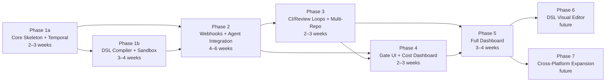

# Implementation Roadmap

> Part of [AI SDLC Orchestrator](../overview.md) specification

---

> **Timeline assumptions:** Estimates assume a single senior full-stack engineer with Temporal and K8s experience. Multiply by 0.6x for a 2-person team. Phases can overlap where dependencies allow (e.g., Phase 4 UI work can start during Phase 3 backend work).

## Phase Dependency Graph

**Parallelization opportunities:**
- Phase 1b (DSL compiler + sandbox) can start once Phase 1a entities and Temporal setup are done (~week 2)
- Phase 4 (UI) can start during Phase 3 (backend loops) — different codepaths
- Phase 6 and Phase 7 are independent of each other

---

## Risk Mitigation

| Risk | Impact | Likelihood | Mitigation |
|---|---|---|---|
| E2B SDK breaking changes | Medium | Medium | Pin SDK version, `SandboxPort` adapter pattern isolates impact to single adapter |
| Claude Agent SDK unavailability | High | Low | Encapsulated inside `ClaudeAgentAdapter` — fallback to `@anthropic-ai/sdk` Messages API + tool use. No impact on `AiAgentPort` consumers |
| Temporal learning curve | Medium | Medium | Phase 1a has dedicated Temporal setup week, TestWorkflowEnvironment for fast iteration |
| Cost overrun by agents | High | Medium | Three-level budget check (per-task, per-tenant, system-wide), adaptive loops, quality gates, optimistic concurrency |
| Webhook delivery gaps | Medium | Medium | Durable ingestion (write-first), polling fallback via Temporal Schedule, periodic reconciliation job |
| Security incident (credential leak) | Critical | Low | Zero-credential sandbox, credential proxy service, per-tenant API key isolation, anomaly detection, MCP server allowlisting |
| Agent Sandbox (K8s) maturity — alpha v0.2.1 | Medium | Medium | `SandboxPort` abstraction means E2B is production-ready today. Agent Sandbox monitored for beta/GA. Fallback: direct Kata integration via K8s API |
| Single-person bottleneck | High | High | Spec-first approach reduces ambiguity. Phases have clear MVP scope for incremental delivery. Task list per phase enables parallel work if team grows |

---

## Phase 1a — Core Skeleton + Temporal (2–3 weeks)

**MVP:** Nx monorepo boots, Temporal Workflow executes a no-op Activity, all entities exist in PostgreSQL with RLS.

- Nx monorepo: `orchestrator-api`, `orchestrator-worker`, `workflow-dsl`, `common/*`, `db`
- NestJS + Fastify bootstrap with three-tier healthcheck endpoints (`/health/live`, `/health/ready`, `/health/business`) via `@nestjs/terminus`. See [Deployment — Healthcheck Endpoints](deployment.md)
- `AiAgentPort` interface — single `invoke()` method (the only port in the system)
- `libs/common/temporal/` — Temporal client factory, Worker factory, interceptors
- Docker Compose: app PostgreSQL + PgBouncer + Temporal auto-setup (server + UI + Elasticsearch for visibility) + agent Docker container for local dev fallback
- Worker validates full Temporal stack with no-op Workflow + Activity
- MikroORM entities + migrations: `Tenant`, `TenantMcpServer`, `TenantVcsCredential`, `TenantRepoConfig`, `WebhookDelivery`, `WorkflowMirror`, `WorkflowEvent`, `AgentSession`, `AgentToolCall`, `WorkflowDsl`, `TenantApiKey`, `TenantUser`, `CostAlert`, `TenantWebhookConfig`, `PollingSchedule`, `McpServerRegistry`
- **RLS policies** on all tenant-scoped tables (`tenant_id`-based row filtering). RLS policy tests in component test suite
- `updateWorkflowMirror` Activity — writes state transitions to app DB
- `Result<T, E>` error handling setup
- Dev tooling: CLAUDE.md, MCP config, Pino → Loki pipeline
- Temporal namespace creation automation (one per tenant)
- **PgBouncer deployment config** — sidecar mode for dev/small deployments, documented migration path to centralized mode
- **`MCP_SERVER_REGISTRY` seed data** — initial curated list of verified MCP servers (platform + productivity servers)

## Phase 1b — DSL Compiler + Sandbox (3–4 weeks)

**MVP:** DSL compiles YAML to Temporal Workflow, E2B sandbox boots and runs a test agent session with credential proxy auth.

> **Risk note:** The DSL compiler is the most complex component in the system — compiling typed YAML to deterministic Temporal Workflow code with version pinning, `patched()` hotfixes, and replay safety. This deserves a dedicated week, not a sub-item of Phase 1.

- Workflow DSL schema (Zod) + compiler (YAML → Temporal Workflow registration). Handle `signal_wait` type separately from `auto` (compiles to `condition()`, not `executeActivity()`)
- DSL version pinning: Workflow records `dslName + dslVersion` at start, replays use pinned version
- DSL compiler tests: validate every step type (`auto`, `signal_wait`, `gate`, `loop`, `terminal`) compiles to valid Temporal Workflow code. Test replay determinism with version changes
- **`SandboxPort` interface + `E2bSandboxAdapter`:** Define `SandboxPort` abstraction (`create`, `exec`, `writeFile`, `readFile`, `destroy`). Implement `E2bSandboxAdapter` wrapping `e2b` npm package. Build E2B sandbox template from `Dockerfile.agent` with toolchain (Git, Node, Python, Go) via `e2b template build`. Validate with a test agent session — verify Firecracker isolation, credential proxy authentication, session token scoping
- **`K8sSandboxAdapter` (parallel):** Implement `K8sSandboxAdapter` wrapping Agent Sandbox SDK / K8s client. Creates SandboxClaim CRDs, interacts via Sandbox Router HTTP API. Requires K8s cluster with Agent Sandbox CRDs + Kata RuntimeClass installed. Validate warm pool allocation, NetworkPolicy enforcement, SandboxClaim TTL cleanup
- Template CI pipeline: `Dockerfile.agent` change → build both E2B template (`e2b template build`) AND OCI image (`docker build`) → smoke test
- Credential proxy deployment: K8s Deployment + Service + Ingress (E2B backend) / ClusterIP (Agent Sandbox backend), JWT session token validation, rate limiting, audit logging

## Phase 2 — Webhook Handlers + Agent Integration (4–6 weeks)

**MVP:** End-to-end flow: Jira webhook → Temporal Workflow → agent creates branch + MR in GitLab → visible in dashboard with cost breakdown.

- Thin webhook handlers: Jira, GitLab, GitHub, Linear (~50 lines each: verify signature, extract event, normalize)
- Webhook deduplication: delivery ID extraction + `WEBHOOK_DELIVERY` table persistence
- **Durable webhook ingestion** — write-first-process-second: persist to `WEBHOOK_DELIVERY` → return 200 → async start Temporal workflow. Retry failed workflow starts from persisted payloads
- **Polling fallback** — Temporal Schedule per-tenant per-platform polling job (`POLLING_SCHEDULE` entity). Queries platform API for tasks not already tracked in `WORKFLOW_MIRROR`
- **Tenant CRUD API** — `POST/GET/PUT /tenants` + nested CRUD for MCP servers, VCS credentials, repo configs. Zod-validated. CLI seed script for initial tenant setup
- **Tenant lifecycle automation** — `TENANT.status` lifecycle: `pending` → `provisioning` (Temporal namespace creation, webhook registration, credential setup) → `active` → `deactivating` → `deactivated` → `deleted`. Onboarding and offboarding automated via Temporal Workflow. See [Data Model — DD-36](data-model.md)
- **Dashboard auth:** OIDC integration (Google/GitHub), API key generation per tenant, RBAC (admin/operator/viewer)
- **Agent provider abstraction** — `AgentProviderRegistry` + `ClaudeAgentAdapter` (v1). Resolution chain: repo config → tenant config → system default. `PromptFormatter` per provider
- Claude Code integration via `@anthropic-ai/claude-agent-sdk` — implements `AiAgentPort.invoke()` inside `ClaudeAgentAdapter`
- `invokeAgent` Activity: generate session token → check admission control (`max_concurrent_sandboxes`) → create sandbox via `SandboxPort.create()` → clone repo → setup → build prompt via `PromptFormatter` → pass MCP servers (filtered by `mcp_server_policy`) → start agent session → heartbeat → collect `AgentResult` (including `toolCalls` for `AGENT_TOOL_CALL` table) → verify agent output (Phase 1 + Phase 2 checks) → destroy sandbox via `SandboxPort.destroy()` → revoke session token
- **Agent output verification (Phase 1):** `git ls-remote` for branch, VCS API call for MR existence
- **Agent output verification (Phase 2):** quality gate execution check, diff size limit, file scope compliance, MR description validation, commit message validation, prompt injection scan
- **Quality gate verification** — scan `AGENT_TOOL_CALL` records for required gate executions (test/lint/typecheck/build)
- **Diff size and file scope enforcement** — `max_diff_lines` and `allowed_paths` from `TENANT_REPO_CONFIG`
- **Prompt injection defense** — three-layer: input sanitization, output validation, credential proxy anomaly detection
- **Agent output scoring** — composite `quality_score` (0.0–1.0) stored in `AGENT_SESSION`
- **Session context preservation** — construct `SessionContext` from `AgentResult` data for fix loop continuity
- Differentiated retry strategy: retry on infra errors (sandbox OOM, E2B API failure). No retry on agent logic errors / cost limit / turn limit (`ApplicationFailure` with `nonRetryable: true`). New error types: `quality_gate_skipped`, `diff_size_exceeded`, `scope_violation`, `prompt_injection_detected`
- Agent MCP pass-through: query `TENANT_MCP_SERVER` → filter by `mcp_server_policy` → build MCP config → pass to agent runtime
- **MCP server policy enforcement** — `curated` mode filters to `MCP_SERVER_REGISTRY` verified servers only
- **Composite budget reservation** — reserve per-task cost (AI + sandbox) with optimistic concurrency (`budget_version`). Three-level check: per-task, per-tenant monthly (AI + sandbox separately), system-wide
- **Per-repo concurrency:** workflow ID = `{tenant}-{provider}-{taskId}`, check `TENANT_REPO_CONFIG.max_concurrent_workflows` before starting
- **E2B admission control** — check `TENANT.max_concurrent_sandboxes` before sandbox creation
- **Credential proxy HA** — 2+ replicas, PodDisruptionBudget, pod anti-affinity, GIT_ASKPASS circuit breaker with short-TTL cache
- **Credential proxy anomaly detection** — sliding window counters, alert on excessive/post-completion/unknown-server requests
- Graceful agent shutdown: SIGTERM at T-5min, 2-min grace period
- `cleanupBranch` Activity: delete remote branch + close draft MR when workflow reaches BLOCKED
- E2E single-repo: task webhook → Temporal Workflow → agent creates branch + code + MR → visible in Temporal UI

## Phase 3 — CI/Review Feedback Loops + Multi-Repo (2–3 weeks)

**MVP:** Failed CI pipeline → agent auto-fixes → green pipeline. Code review comment → agent addresses feedback. Multi-repo parent workflow orchestrates children.

- CI webhook handlers → signal running Workflow (`pipelineFailed` / `pipelineSucceeded`)
- Review webhook handlers → signal (`changesRequested`)
- `ci_watch` step compiled as Workflow-level `condition()` wait (not an Activity) with 2h timeout
- **Adaptive CI fix loop** — `loop_strategy` with progress detection: no-progress detection, regression handling, escalation. Agent receives `SessionContext` (structured previous iteration data) instead of bare summary
- **Adaptive review fix loop** — same adaptive strategy with review-specific context
- Multi-repo: parent Temporal Workflow spawns child workflow executions. Configurable failure strategy (`wait_all` / `fail_fast`)
- **DSL v1.1** — `parallel` step type (fan-out/fan-in with `join_strategy`) + `conditional` transitions (workflow variable comparisons)
- **Static analysis gate** — configurable per-repo via `static_analysis_command`, executed post-agent, result stored in `AGENT_SESSION`
- **Sparse checkout** — `clone_strategy: sparse` with `sparse_checkout_paths` for monorepo optimization
- **Smart per-repo concurrency** — `concurrency_hints` with `path_isolation` mode for non-overlapping file paths
- E2E: red pipeline → agent fix loop → green pipeline → review → done

## Phase 4 — Gate UI + Cost Dashboard (2–3 weeks)

**MVP:** Dashboard shows workflows with gate approval buttons, cost breakdown (AI vs sandbox), and agent session details.

- Gate approval: `POST /workflows/:id/gates/:gateId/approve` → `gateApproved` signal (authenticated, RBAC-checked)
- Minimal dashboard:
  - Tenant config screens (MCP servers, VCS credentials, repo configs — from normalized tables)
  - Gate approval UI (workflows waiting for approval)
  - Cost dashboard from app DB — multi-dimensional: by AI provider, by sandbox runtime, by repo, by task complexity tier. Split AI vs sandbox costs. Alert history from `COST_ALERT`
  - Agent session viewer: tool calls timeline from `AGENT_TOOL_CALL` table, quality score display
- Temporal UI remains primary visibility tool — link from dashboard per workflow
- Prometheus + Grafana dashboards: throughput, success rate, cost/task, E2B sandbox metrics, quality score trends
- Webhook delivery log viewer (from `WEBHOOK_DELIVERY` table)
- **DSL patch management dashboard** — version distribution, drain status, deprecation warnings
- **DSL validation CLI** — `dsl validate`, `dsl diff`, `dsl drain-status` commands

#### Self-Service Testing Endpoints
- `POST /test/mcp-connectivity` — validate MCP server configurations without launching an agent session
- `POST /test/sandbox` — boot a sandbox, run health check, destroy (validates template + credentials)
- `POST /test/agent-dry-run` — run agent with a mock task in sandbox, verify tool access, return structured report

## Phase 5 — Full Custom Dashboard (3–4 weeks)

**MVP:** Full workflow lifecycle visible in custom dashboard with real-time updates and alerting.

- Workflow list: all workflows with status badges, filters — from `workflow_mirror` via Elasticsearch-backed Temporal queries
- Workflow detail: timeline from `workflow_event`, agent session panel (tool calls, summary, quality score), cost breakdown (AI + sandbox), link to Temporal UI
- SSE endpoint: real-time state updates tailing `workflow_event`
- Alerts on cost spikes, stuck workflows, failure rates, pod OOM kills, quality score degradation
- Periodic reconciliation dashboard: stale mirrors, orphaned cost reservations
- Provider comparison analytics: quality scores, costs, and success rates across Claude vs OpenHands vs Aider

## Phase 6 — DSL Visual Editor (future)

- React Flow-based editor for workflow YAML DSL
- Drag-and-drop steps, gate condition editor, loop strategy config, parallel step builder
- Real-time Zod validation via `@ai-sdlc/workflow-dsl-schema`
- Per-tenant versioning and rollback

## Phase 7 — Cross-Platform Expansion (future)

- YouTrack, ClickUp webhook handlers + MCP server configs
- Bitbucket webhook handler + MCP server config
- OpenHands + Aider agent support via `AiAgentPort` adapters
- Team management, audit log viewer

#### Temporal Cloud Option
- `temporal.mode: 'cloud' | 'self-hosted'`
- Cloud mode eliminates: self-hosted Temporal cluster, Elasticsearch for visibility, dedicated PostgreSQL for Temporal
- Trade-off: ~$200–500/mo vs. operational complexity of self-hosted cluster
- Recommended for SaaS deployments; self-hosted required for regulated/air-gapped environments

---

## Open Questions

### Resolved

| Question | Decision | Rationale |
|---|---|---|
| **MikroORM vs Prisma** | **MikroORM** | Unit of Work, explicit transactions, better for Activity-level DB control where you need to confirm DB write before marking Activity complete |
| **Temporal DB: shared or dedicated PostgreSQL?** | **Dedicated** | Separate instance for isolation, independent scaling, simpler DR. SaaS with many tenants needs this |
| **Agent sandbox isolation** | **Multi-backend via `SandboxPort`** | Two backends selected per deployment model: (1) **E2B** (Cloud or BYOC) for SaaS — Firecracker microVM, purpose-built for AI agents, fastest time-to-market. (2) **K8s Agent Sandbox + Kata Containers** for regulated/banking/on-prem — K8s-native CRDs, hardware VM isolation (0 hypervisor-escape CVEs), runs in same cluster, NetworkPolicy per template. `SandboxPort` abstraction lets the orchestrator core remain backend-agnostic. See [Sandbox & Security](sandbox-and-security.md) |
| **Agent reliability for MR creation** | **`cleanupBranch` Activity** | When workflow reaches BLOCKED, a cleanup Activity deletes the remote branch and closes any draft MR. Prevents orphaned resources |
| **`resumeSession` semantics** | **No resume — fresh sessions with `SessionContext`** | Each invocation (implement, ci_fix, review_fix) is a fresh agent session. `SessionContext` (server-side ground truth: files modified, test output, tool call summary) + existing branch state provides continuity. No conversation history persistence needed |
| **Credential proxy isolation** | **External service model** (separate host) | Credential proxy runs as a standalone K8s service, not a sidecar. E2B sandbox and credential store are on completely separate hosts — stronger isolation than sidecar model. Session-scoped JWT authentication. See [Sandbox & Security — Credential Proxy](sandbox-and-security.md) |
| **Agent output trust** | **Two-phase server-side verification** | Phase 1: branch existence (`git ls-remote`), MR existence (VCS API). Phase 2: quality gate execution, diff size, file scope, MR description, commit messages, prompt injection scan |
| **Retry strategy** | **Error-type differentiation** | Retry on infra errors (pod OOM, scheduling failure). No retry on agent logic errors, cost limit, turn limit. `ApplicationFailure` with `nonRetryable: true`. New error types for quality violations |
| **Local dev sandbox** | **E2B sandboxes (same as production)** | E2B Cloud is the default dev/CI backend — API-driven, works from any environment, no KVM requirement. Agent Sandbox + Kata tested in staging (KVM-capable cluster). `SandboxPort` abstraction means same code path regardless of backend |
| **DSL compiler timeline** | **Dedicated Phase 1b (2–3 weeks)** | DSL compiler is the most complex component — version pinning, replay determinism, `patched()` hotfixes. Deserves dedicated week, not a sub-item |
| **MCP server scoping per tenant** | **`mcp_server_policy` + `MCP_SERVER_REGISTRY`** | Two modes: `curated` (only verified servers from registry) and `open` (tenant-managed). Default `curated` for new tenants. `scoping_capability` field on registry tracks per-server access granularity |
| **Sandbox concurrency limits** | **Per-tenant `max_concurrent_sandboxes` with admission control** | Admission control Activity checks tenant limit before `invokeAgent`. Default 5 per tenant. E2B tier limits and K8s node capacity addressed by admission control + backpressure |
| **Egress control by backend** | **Credential proxy as L7 inspection + infra egress** | Credential proxy logs all outbound API calls (L7 visibility). Infrastructure-level egress (E2B `allowOut`/`denyOut`, K8s NetworkPolicy) provides network-level control per deployment model |
| **Credential proxy high availability** | **2+ replicas, PDB, GIT_ASKPASS circuit breaker** | PodDisruptionBudget (minAvailable: 1), pod anti-affinity across nodes. Circuit breaker in sandbox: if proxy unreachable after 3 retries, fail open with 60s cached credentials. `/healthz` + `/livez` endpoints |
| **Agent prompt injection** | **Three-layer defense-in-depth** | (1) Input sanitization: strip known injection patterns from task descriptions. (2) Output validation: scan MR descriptions, commit messages for credentials/suspicious content. (3) Credential proxy anomaly detection: flag unusual API patterns. See [Integration — Prompt Injection Defense](integration.md) |
| **Agent output quality** | **Two-phase verification + quality scoring** | Phase 1: existence checks. Phase 2: quality gates, diff limits, scope, description, commit messages, injection scan. Composite `quality_score` (0.0–1.0) for analytics. See [Deployment — Agent Output Scoring](deployment.md) |
| **Agent model routing per task complexity** | **Label-based model routing** | `TENANT_REPO_CONFIG.model_routing` (JSONB) maps task complexity labels to models. Example: `{"trivial": "claude-haiku-4-5", "standard": "claude-sonnet-4-6", "complex": "claude-opus-4-6"}`. Resolution chain: task label → model_routing → repo agent_model → tenant default_agent_model → system default |
| **Fix loop iterations** | **Adaptive `loop_strategy` with progress detection** | Replaces fixed `max_iterations: 3`. LoopState tracks errors_before/after per iteration. Decision logic: hard stop, no-progress detection, regression handling, escalation. Backward compatible — default strategy matches old behavior. See [Workflow Engine — Adaptive Loop Strategy](workflow-engine.md) |
| **`@anthropic-ai/claude-agent-sdk` availability** | **Encapsulated inside `ClaudeAgentAdapter`** | SDK wrapped by adapter implementing `AiAgentPort`. If SDK unavailable, adapter uses `@anthropic-ai/sdk` Messages API + tool use. No impact on orchestrator core or other providers |
| **AI provider API key in sandbox** | **Zero API keys in sandbox — AI API proxy** | Credential proxy's `/ai-api/{provider}/*` endpoint injects `x-api-key` server-side. Sandbox receives only `AI_API_BASE_URL` pointing to proxy. All old `AI_PROVIDER_API_KEY` env var references removed. See [Sandbox & Security — AI API Proxy](sandbox-and-security.md) |
| **MCP token trust boundary** | **Acknowledged transit-time exposure with mitigations** | MCP tokens fetched just-in-time from credential proxy during sandbox init, passed to MCP server processes as env vars. Same trust boundary as VCS PATs via `GIT_ASKPASS`. Mitigated by session-scoped TTL, anomaly detection, rate limiting. See [Integration — MCP Token Injection](integration.md) |
| **Redis dependency** | **Optional cache layer (Redis 7)** | Budget reservation hot path, API rate limiting, session token revocation. All Redis-backed features fall back to PostgreSQL when unavailable. Added to tech stack and deployment config. See [Tech Stack](tech-stack.md), [Deployment — Configuration](deployment.md) |
| **GDPR / data privacy** | **Privacy & Data Governance section** | Data retention policies per entity, right-to-erasure workflow (automated via Temporal), data export API, PII handling rules, cross-border data transfer documentation, DPA requirements. See [Deployment — Privacy & Data Governance](deployment.md) |
| **App DB high availability** | **Patroni + streaming replication (self-hosted) or managed HA (cloud)** | Synchronous replication, automatic failover, RPO 0, RTO < 30s. PgBouncer reconnects automatically. See [Deployment — PostgreSQL High Availability](deployment.md) |
| **API versioning** | **URL-prefix versioning (`/api/v1/`)** | Major version bumps for breaking changes (6-month support window), additive-only policy within versions, `Sunset` header on deprecated endpoints. See [Deployment — API Versioning](deployment.md) |
| **RBAC granularity** | **Scoped RBAC with per-repo permissions** | `TENANT_USER.repo_access` JSONB for per-repo role scoping. Null = full access (backward-compatible). Gate approvals and dashboard filtered by repo access. Admin role always has full access. See [Data Model — DD-35](data-model.md) |
| **`publish_artifact` implementation** | **Shell script in sandbox template + per-provider registration** | `/usr/local/bin/publish-artifact` baked into `Dockerfile.agent`. Claude: `allowedTools` config. OpenHands: custom tool config. Aider: shell command allowlist. Writes to `/workspace/.artifacts/<uuid>.json`. See [Integration — Artifact Publishing](integration.md) |
| **Graceful shutdown fragility** | **Two-tier shutdown: sentinel file + SIGTERM** | Sentinel file at T-5min (checked between tool calls). SIGTERM at T-2min (interrupts long-running commands). Force destroy at T-0. Default 5-min total grace period, configurable via DSL. See [Integration — Graceful Shutdown](integration.md) |
| **Sandbox pause/resume on Kata** | **PVC-based workspace persistence** | Kata pause: delete pod, retain workspace PVC. Resume: create new pod with same PVC mounted at `/workspace`. 30-min PVC garbage collection if not resumed. Preserves cloned repo and deps. See [Sandbox & Security — Sandbox Pause/Resume](sandbox-and-security.md) |
| **Tenant offboarding** | **`TENANT.status` lifecycle with automated erasure** | Status: `active` → `deactivating` (drain 24h) → `deactivated` (retain 90d) → `deleted` (erasure workflow). Supersedes `onboarding_status`. See [Data Model — DD-36](data-model.md), [Deployment — Right-to-Erasure](deployment.md) |
| **Internal MCP servers from E2B Cloud** | **Documented limitation with backend recommendations** | E2B Cloud = public internet only. Internal MCP servers require E2B BYOC (VPC peering) or Agent Sandbox + Kata (same cluster). `command`-type MCP servers unaffected. See [Sandbox & Security — Network Reachability](sandbox-and-security.md) |
| **Webhook secret rotation** | **Dual-secret validation with rotation API** | `TENANT_WEBHOOK_CONFIG.previous_secret_ref` enables dual-secret window (24h default). Both old and new secrets accepted during rotation. `POST .../rotate` API endpoint. See [Deployment — Webhook Secret Rotation](deployment.md) |
| **Cost tracking via AI API proxy** | **SSE stream parsing for real-time token extraction** | Credential proxy parses `usage` field from final SSE event per provider (Anthropic `message_stop`, OpenAI final chunk). Accumulated per session, flushed on session end. Fallback to agent SDK self-reporting. See [Deployment — AI Cost Extraction](deployment.md) |
| **Orchestrator deployment strategy** | **Temporal Worker Build IDs for safe rolling updates** | New Build ID per release. Backward-compatible changes: compatible version set (instant rollout). Breaking workflow code: new default version set (old workflows drain on old workers). API pods: standard K8s rolling update with PDB. See [Deployment — Orchestrator Deployment Strategy](deployment.md) |
| **DSL expression parser security** | **Filtrex sandbox + strict field allowlist** | Conditional DSL expressions evaluated via `filtrex` (sandboxed, no global/eval/prototype access). Strict allowlist of `agent.*` and `workflow.*` fields. Validated at DSL compile time. See [Workflow Engine — Conditional Transitions](workflow-engine.md) |
| **Database migration strategy** | **Expand-contract pattern with K8s Job** | Zero-downtime DDL via expand-migrate-contract phases. MikroORM `migration:up` as Helm pre-deploy Job. Partitioned tables use raw SQL. CI validates schema drift. See [Deployment — Database Migration Strategy](deployment.md) |
| **Polling rate limit management** | **Per-platform token bucket + adaptive intervals** | Global rate limit per platform shared across tenants. Adaptive interval on 429/low remaining quota. Tenant priority for rate budget allocation. See [Deployment — Polling Fallback](deployment.md) |
| **Artifact upload idempotency** | **UUID-based paths + HeadObject check** | Upload path includes artifact UUID. Activity retries check `HeadObject` before re-uploading. Prevents orphaned duplicates. See [Integration — Artifact Publishing](integration.md) |
| **Large artifact handling** | **100 MB limit, multipart upload, streaming, tenant quotas** | Files > 10 MB use S3 multipart. > 100 MB rejected at script level. Streaming upload avoids worker memory pressure. Per-tenant 10 GB/month quota. See [Integration — Artifact Size Limits](integration.md) |
| **Agent model deprecation** | **Model validation + bulk migration API** | `SUPPORTED_MODELS` config validated at workflow start. Deprecated models: warning + dashboard notification. Removed models: workflow rejected. `POST /admin/models/migrate` for bulk updates. See [Data Model — DD-37](data-model.md) |
| **Temporal workflow code versioning** | **Worker Build IDs + version set routing** | Separate from DSL versioning. Breaking workflow code changes = new default version set. Old workflows drain on old workers. Build ID = `{version}-{git-sha}`. Monitoring via task count per Build ID. See [Workflow Engine — Orchestrator Workflow Code Versioning](workflow-engine.md) |
| **Concurrent artifact publishing** | **UUID-based filenames + timestamp-ordered supersede** | Each `publish_artifact` call generates unique UUID — no filename collisions. Same-kind artifacts in same session: auto-supersede by creation timestamp at session end. See [Integration — Artifact Publishing](integration.md) |
| **Credential proxy TLS gap (E2B Cloud)** | **Pod-level TLS or service mesh required** | For E2B Cloud path: TLS must be maintained sandbox → proxy pod (not just Ingress termination). Options: pod-level TLS (passthrough Ingress) or service mesh mTLS. See [Sandbox & Security — Credential Proxy Networking](sandbox-and-security.md) |
| **Sandbox template supply chain** | **SBOM + npm audit + package pinning + image signing** | Syft SBOM generation, npm/pip lockfiles with integrity hashes, `--ignore-scripts`, Cosign image signing, MCP server package verification audit. See [Sandbox & Security — Template Versioning](sandbox-and-security.md) |

### Open

| Question | Context | Decision Needed By |
|---|---|---|
| **Gate approval UX: dashboard vs tracker comment** | Dashboard UI (explicit, traceable) vs reply to Jira/GitLab comment (easier for reviewers in the tracker). Both can coexist — comment triggers webhook, dashboard is fallback | Phase 4 start |
| **Elasticsearch vs OpenSearch for Temporal visibility** | Both supported by Temporal. Elasticsearch is the default. OpenSearch is fully open-source (no licensing concerns). For self-hosted SaaS, OpenSearch may be preferable | Phase 1a start |
| **Agent conversation log storage** | `AGENT_TOOL_CALL` captures tool calls, but full conversation logs (reasoning, intermediate thoughts) could be valuable for debugging. Storage cost vs debugging value. Consider: store full logs in MinIO (S3-compatible, same instance as artifact storage), reference from `AGENT_SESSION`, 30-day retention | Phase 2 |
| **Multi-repo review gate UX** | Parent workflow has N child MRs. Does the reviewer approve each MR individually (N approvals) or approve the parent workflow (1 approval, auto-merges all)? Former is safer but slower | Phase 3 |
| **Sandbox backpressure** | If 50 workflows start simultaneously, 50 sandbox creation calls hit E2B API (or 50 SandboxClaims created). Temporal's `maxConcurrentActivityTaskExecutions` limits per-worker, but cluster-wide surge needs capacity planning. Admission control (`max_concurrent_sandboxes`) provides per-tenant limit but not global backpressure | Phase 2 |
| **Agent Sandbox maturity** | K8s Agent Sandbox is alpha (v0.2.1). `SandboxPort` abstraction mitigates risk — E2B backend is production-ready today. Monitor Agent Sandbox for beta/GA. If it stalls, the Kata backend can be implemented directly against K8s API without the Agent Sandbox CRDs | Phase 2+ |
| **Agent Sandbox warm pool sizing** | Warm pool size affects startup latency vs resource cost. Need benchmarking: how many concurrent sandboxes per KVM node? What's the optimal warm pool size for p95 < 1s allocation? Auto-scaling warm pool based on queue depth | Phase 2 |
| **Per-provider E2B templates** | Single fat template with all provider runtimes (Claude SDK, OpenHands, Aider) vs per-provider templates (smaller image, faster boot, but more templates to manage). Fat template simpler for v1, per-provider may be needed at scale | Phase 2 |
| **E2B sandbox pricing accuracy** | `TENANT.sandbox_hourly_rate_usd` must stay in sync with actual E2B pricing. Consider: periodic sync via E2B billing API, or admin-managed rate with alerting on drift | Phase 2 |
| **MCP server cost tracking** | Track cost of MCP server calls (external API usage) via response headers or provider billing. Provider-dependent — not all MCP servers expose cost data | v2+ |
