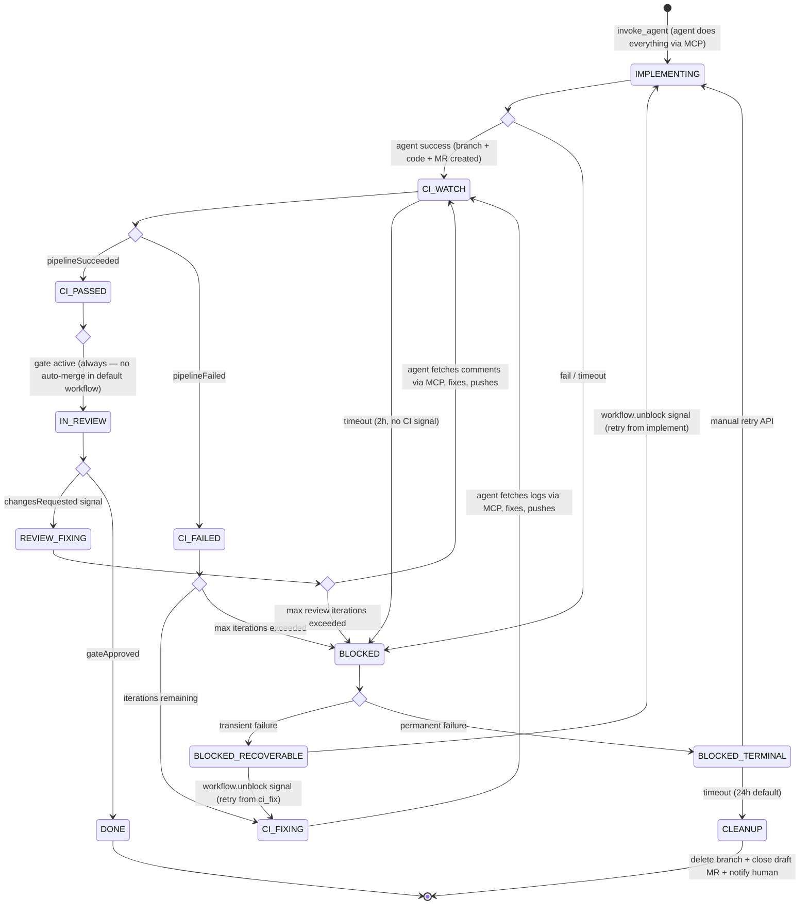
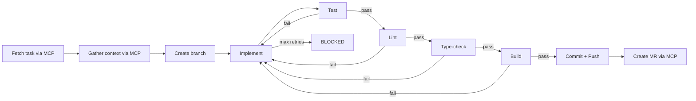
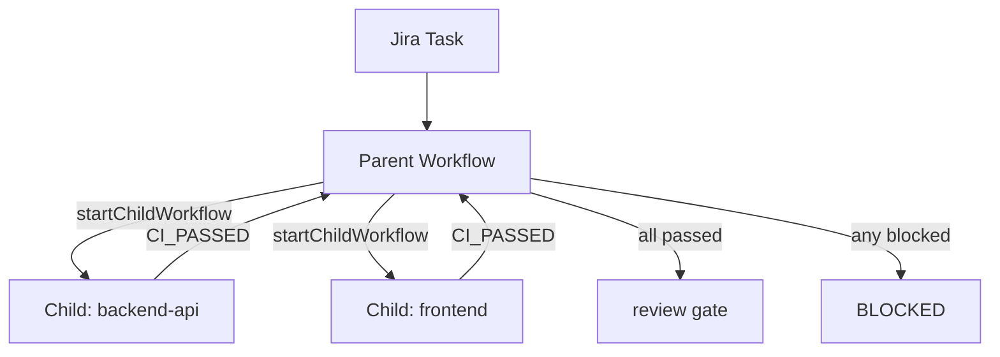

# Workflow Engine

> Part of [AI SDLC Orchestrator](../overview.md) specification

---

## Event System

All external webhooks are normalized into a unified **OrchestratorEvent** and delivered as Temporal Signals or used to start new Workflows.

| Event | Source | Temporal Action |
|---|---|---|
| `task.ready` | Task Tracker | Start new `WorkflowExecution` |
| `task.updated` | Task Tracker | Signal running workflow (`taskUpdated`) |
| `pipeline.success` | CI Provider | Signal (`pipelineSucceeded`) |
| `pipeline.failed` | CI Provider | Signal (`pipelineFailed`) |
| `mr.merged` | VCS | Signal (`mrMerged`) |
| `mr.changes_requested` | VCS | Signal (`changesRequested`) |
| `gate.approved` | Dashboard / API | Signal (`gateApproved`) |
| `workflow.unblock` | Dashboard / API | Signal (`workflowUnblock`) — Retry a blocked workflow. Payload: `{ reason: string }`. Only effective when workflow is in `BLOCKED_RECOVERABLE` state. |

Human gate approvals: `POST /workflows/:id/gates/:gateId/approve` → sends `gateApproved` signal. The Workflow parks at `condition()` until the signal arrives or the timeout elapses.

> **Note:** `task.updated` signals are delivered to the running Workflow but are not consumed by the default DSL. The Workflow logs them as `WORKFLOW_EVENT` entries for audit. Custom DSL variants can add a `signal_wait` step that reacts to `taskUpdated` (e.g., to re-plan if requirements change mid-implementation).

### Webhook Deduplication & Persistence

Webhooks from external platforms can be delivered multiple times (network retries, platform bugs). The ingress layer handles this at three levels:

1. **Workflow starts** — Temporal natively deduplicates `startWorkflow` calls with the same Workflow ID. The Workflow ID is derived deterministically from `{tenant}-{taskProvider}-{taskId}`, so duplicate `task.ready` webhooks are idempotent.
2. **Signals** — Each webhook carries a platform-specific delivery ID (e.g., Jira `X-Atlassian-Webhook-Identifier`, GitLab `X-Gitlab-Event-UUID`, GitHub `X-GitHub-Delivery`). The webhook handler extracts this ID. Before signaling, the ingress checks the `WEBHOOK_DELIVERY` table for duplicates. Duplicate delivery IDs are acknowledged (200 OK) but not forwarded to the Workflow.
3. **Idempotent signal handlers** — Workflows treat signals idempotently where possible (e.g., receiving `pipelineSucceeded` twice in `CI_PASSED` state is a no-op).

**Webhook persistence:** Every incoming webhook is recorded in the `WEBHOOK_DELIVERY` table (see [Data Model](data-model.md)) with status `processed`, `deduplicated`, or `invalid`. This provides:
- **Debugging** — "why didn't my task trigger?" → query webhook history
- **Audit trail** — full record of external platform interactions
- **Replay** — in case of missed webhooks, replay from the table via admin API
- **Retention:** 30 days, then archived or deleted by a scheduled job

---

## Workflow DSL

Workflows are defined in typed YAML compiled to Temporal Workflow code at startup. The DSL is the stable contract between the definition layer and Temporal.

```yaml
name: default
version: 1

steps:
  - id: implement
    type: auto
    action: invoke_agent            # Agent does everything: fetch task, gather context,
    mode: implement                 # create branch, implement, test, create MR, push
    timeout_minutes: 60
    graceful_shutdown_minutes: 5    # Warn agent at T-5min to wrap up
    on_success: ci_watch
    on_failure: blocked

  - id: ci_watch
    type: signal_wait               # NOT an Activity — Workflow-level condition()
    signal: pipelineSucceeded | pipelineFailed
    timeout_hours: 2
    on_success: review_gate
    on_failure: ci_fix_loop
    on_timeout: blocked

  - id: ci_fix_loop
    type: loop
    action: invoke_agent            # Fresh session — agent gets previousSessionSummary
    mode: ci_fix                    # + prompt to fetch CI logs via MCP, fix, push
    loop_strategy:
      max_iterations: 5
      no_progress_limit: 2
      regression_action: stop
      escalation_threshold: 3
    timeout_minutes: 60
    on_success: ci_watch
    on_exhausted: blocked

  - id: review_gate
    type: gate
    signal: gateApproved | changesRequested
    condition:
      always: true
    require_artifacts:                   # Optional — gate checks artifacts exist before allowing approval
      - kind: merge_request              # At least one artifact of this kind must be published
    review_context:                      # Artifacts to surface to the reviewer
      artifacts: [merge_request]
    timeout_hours: 72
    on_approved: done
    on_changes_requested: review_fix_loop
    on_timeout: blocked
    # No on_skipped — auto-merge without human review is not supported.
    # Tenants who want auto-merge must define a separate workflow DSL
    # with an explicit `auto_merge` step that requires additional
    # safeguards (label filter, max diff size, test coverage threshold).

  - id: review_fix_loop
    type: loop
    action: invoke_agent            # Fresh session — agent gets previousSessionSummary
    mode: review_fix                # + prompt to fetch review comments via MCP, fix, push
    loop_strategy:
      max_iterations: 5
      no_progress_limit: 2
      regression_action: stop
      escalation_threshold: 3
    timeout_minutes: 60
    on_success: ci_watch
    on_exhausted: blocked

  - id: done
    type: terminal
    action: close_workflow

  - id: blocked
    type: recovery                  # Non-terminal — supports unblock signal and manual retry
    subtypes:
      recoverable:                  # Transient: sandbox capacity, API rate limit, budget exhausted
        on_unblock: retry_step      # workflow.unblock signal retries the blocked step
      terminal:                     # Permanent: max fix iterations exceeded, security violation
        cleanup_timeout_hours: 24   # Auto-cleanup after timeout
    action: cleanup_and_escalate    # Meaningful progress = at least one commit pushed to the branch.
                                    # If branchName exists on remote with commits beyond base branch:
                                    #   preserve the branch and MR (mark as draft), escalate to human.
                                    # If no commits pushed: delete branch + close MR, escalate to human.
```

#### BLOCKED State Recovery

The `BLOCKED` state is **non-terminal** and supports recovery:

| Subtype | Condition | Behavior |
|---------|-----------|----------|
| `BLOCKED_RECOVERABLE` | Transient failures (sandbox capacity, API rate limit, budget exhausted temporarily) | Can be retried via unblock signal |
| `BLOCKED_TERMINAL` | Permanent failures (max fix iterations exceeded, security violation) | Requires manual intervention; sandbox cleanup after configurable timeout |

**Unblock Signal**: `workflow.unblock`
- Transitions `BLOCKED_RECOVERABLE` → retries the blocked step (e.g., back to `IMPLEMENTING` or `CI_FIXING`)
- Ignored if workflow is in `BLOCKED_TERMINAL`

**Retry API**:
```
POST /workflows/:id/retry?from_step={stepId}
```
- Restarts workflow execution from a specific step
- Validates that the workflow is in `BLOCKED` state
- Creates a new `WORKFLOW_EVENT` with `type: 'manual_retry'`
- Resets the fix iteration counter if retrying from `IMPLEMENTING`

**State Transitions**:
```
BLOCKED_RECOVERABLE → (workflow.unblock signal) → IMPLEMENTING | CI_FIXING
BLOCKED_TERMINAL → (manual retry API) → IMPLEMENTING
BLOCKED_TERMINAL → (timeout: 24h default) → cleanup sandbox, archive workflow
```

The DSL is dramatically simpler — no separate `validate_task`, `enrich_context`, `create_branch`, `open_mr` steps. The agent handles all of these internally via MCP + built-in tools.

> **Note on `invoke_agent` in loops:** Fix loops (`ci_fix_loop`, `review_fix_loop`) use the same `invoke_agent` action with a different `mode` (ci_fix / review_fix). Each invocation is a fresh agent session — the Activity re-clones the repo, checks out the existing branch, and passes `previousSessionSummary` from the last session's `AgentResult.summary`. No session state is persisted or "resumed."

> **Review-fix re-review cycle:** After a review fix, the workflow routes back to `ci_watch` (not `review_gate`), meaning the code must pass CI again before re-review. This is intentional — code changes during review fix may introduce new issues that require fresh CI validation and review.

### DSL Concepts

| Concept | Description | Temporal Mapping |
|---|---|---|
| `auto` step | Runs a Temporal Activity | `workflow.executeActivity(action, options)` |
| `signal_wait` step | Waits for an external signal (webhook) or timeout | `condition(() => signalReceived, { timeout })` — Workflow-level, no Activity |
| `gate` step | Requires explicit human approval (approval signal or timeout). Optionally validates required artifacts before allowing approval | Same as `signal_wait` with approval semantics + artifact validation |
| `loop` step | Adaptive iteration with configurable strategy — progress detection, regression handling, escalation | `loop` in Workflow code with `LoopState` tracking |
| `terminal` step | Final activity (cleanup / close) | `return` after final Activity |
| `recovery` step | Non-terminal blocked state with recoverable/terminal subtypes. Supports `workflow.unblock` signal and manual retry API | `condition()` waiting for unblock signal or retry, with timeout for cleanup |
| `parallel` step | Fan-out/fan-in step type | Child Workflows or `Promise.all` |
| `conditional` transition | Transition conditions based on `AgentResult` or workflow variables | Workflow code branching |
| `condition` | Evaluated at runtime to decide if gate is active | Workflow code condition |

> **Note:** `invoke_agent` is provider-agnostic — the actual AI provider is resolved at Activity execution time based on repo config → tenant config → system default. See [Integration — Agent Provider Resolution](integration.md).

**Signal ordering:** Temporal delivers signals in FIFO order. If `pipelineFailed` and `pipelineSucceeded` arrive while the Workflow is in `ci_watch`, the first signal processed determines the transition. Subsequent signals for the same `ci_watch` step are ignored (the step has already transitioned). The Workflow does not inspect signal queues retroactively.

### DSL Versioning & In-Flight Workflow Safety

Temporal requires strict determinism — changing a Workflow definition breaks replay for in-flight executions. The DSL compiler handles this:

1. **Immutable versions** — Each DSL definition has a `version` field. Modifying a workflow creates a new version; existing versions are never mutated.
2. **Version pinning** — When a Workflow starts, it records `dslName + dslVersion` in its state. The compiled Workflow code for that version is loaded at replay time, not the latest version.
3. **Temporal `patched()` for hotfixes** — If a critical fix must apply to in-flight workflows, the compiled code uses Temporal's `patched(patchId)` / `deprecatePatch(patchId)` API to branch behavior based on whether the workflow started before or after the fix.
4. **New workflows use latest active version** — The `is_active` flag on `WORKFLOW_DSL` determines which version new workflows use. Old versions remain available for replay of in-flight workflows.
5. **Drain strategy** — Before deleting an old DSL version, verify no in-flight workflows reference it (query `workflow_mirror` for `current_step_id != terminal` + matching DSL version).

---

## Adaptive Loop Strategy

Fix loops (CI fix, review fix) use an adaptive strategy instead of a fixed iteration count. Each iteration tracks progress to make intelligent stop/continue decisions.

### LoopState Tracking

Per iteration, the orchestrator records:
- `iteration`: current iteration number (1-based)
- `errors_before`: error/failure count before agent ran (from CI output or review comments)
- `errors_after`: error/failure count after agent ran
- `files_modified`: files the agent changed in this iteration
- `test_output_snippet`: truncated test/lint output for context

### Decision Logic

After each iteration, the orchestrator evaluates (in order):

1. **Hard stop** — `iteration >= max_iterations` → `error_code: max_iterations_exceeded`, workflow transitions to `ai_blocked`
2. **No-progress detection** — if `errors_after >= errors_before` for `no_progress_limit` consecutive iterations → `error_code: no_progress`, stop loop
3. **Regression detection** — if `errors_after > errors_before` (agent made things worse):
   - `regression_action: 'stop'` → `error_code: test_regression`, stop immediately
   - `regression_action: 'retry_once'` → retry one more time with explicit "you introduced a regression" context
4. **Progress-based escalation** — if `iteration >= escalation_threshold` and still failing → enrich the next iteration's prompt with cumulative context from ALL previous iterations (full `SessionContext` history)
5. **Success** — `errors_after === 0` → loop exits successfully, workflow continues

### Progress Snapshot

After each agent session, the orchestrator constructs a `SessionContext` from `AgentResult` data:
- `summary` — agent-generated summary
- `filesModified` — from `diffStats.filesChanged`
- `testOutputSnippet` — from agent's test execution output
- `toolCallsSummary` — from `AGENT_TOOL_CALL` records (top 10 by relevance)
- `errorCode` — if the session failed

This `SessionContext` is passed as `previousSessionContext` to the next iteration, providing server-side ground truth rather than relying on agent self-reporting.

### LoopStrategy Schema

```typescript
const LoopStrategySchema = z.object({
  max_iterations: z.number().min(1).max(10).default(3),
  no_progress_limit: z.number().min(1).max(5).default(2),
  regression_action: z.enum(['stop', 'retry_once']).default('stop'),
  escalation_threshold: z.number().min(1).max(10).default(3),
});
```

### Backward Compatibility

If `loop_strategy` is not specified in the DSL (legacy workflows), the default is applied:
```yaml
loop_strategy:
  max_iterations: 3
  no_progress_limit: 2
  regression_action: stop
  escalation_threshold: 3
```

This preserves the existing behavior of "retry up to 3 times" while enabling tenants to opt into adaptive strategies.

---

## Cost Tracking

When a workflow starts, the orchestrator estimates cost based on task labels → `cost_tiers` mapping → per-task `cost_limit_usd`. This estimated cost is pre-reserved from the tenant's budget before the first agent invocation (see [Deployment — Budget Reservation](deployment.md)).

Each Activity that invokes an agent reports back `ai_cost_usd` and `sandbox_cost_usd` separately. These are accumulated in the workflow state and persisted to `WORKFLOW_EVENT` at each state transition. The `WORKFLOW_MIRROR` is updated with running totals of `ai_cost_usd` and `sandbox_cost_usd`.

---

## Workflow State Machine



> **Note on `gateApproved` vs `mrMerged`:** The `gateApproved` signal is the workflow's transition trigger to DONE. In the default workflow, the reviewer's approval-and-merge action triggers: (1) the VCS webhook delivering `mrMerged` to the orchestrator, and (2) the dashboard/API sending `gateApproved`. The `mrMerged` signal is logged as a `WORKFLOW_EVENT` for audit but is not consumed by the default DSL — `gateApproved` alone drives the DONE transition. A future DSL variant may separate approval and merge into distinct steps.

### Agent Inner Loop (Inside IMPLEMENTING)



> **Note:** Push must happen before MR creation — the branch must exist on the remote for the MR to reference it.

The entire inner loop runs within the `invokeAgent` Activity. The agent uses built-in tools (Bash for test/lint/build/git, Read/Write/Edit for code) and MCP servers (for task details, MR creation, context gathering).

---

## Multi-Repo Workflows

Parent spawns child Temporal Workflows per repo. Children run independently. Parent awaits all child handles — Temporal coordinates natively.



**Failure strategy** (configurable per workflow DSL):
- **`wait_all`** (default) — Parent waits for all children to complete regardless of individual failures. If any child is BLOCKED, parent transitions to BLOCKED after all finish. Avoids wasting partial progress.
- **`fail_fast`** — Parent cancels remaining children when the first child fails. Saves cost but loses partial work. The `cleanupBranch` Activity runs for cancelled children to delete orphaned branches.
- The parent Workflow records per-child results in `workflow_mirror.children_status` (JSONB) for dashboard visibility.

**Per-repo concurrency in multi-repo:** Each child workflow targets a different repo, so per-repo concurrency limits (see [Deployment — Configuration](deployment.md)) apply independently. If one repo has a concurrent workflow in progress, that child queues while siblings proceed.

---

## Extended Step Types (v1.1)

### Parallel Steps

The `parallel` step type enables fan-out/fan-in execution:

```yaml
- id: parallel_checks
  type: parallel
  branches:
    - id: lint_check
      action: invoke_agent
      agent_mode: lint_fix
    - id: type_check
      action: invoke_agent
      agent_mode: typecheck_fix
  join_strategy: wait_all   # 'wait_all' | 'fail_fast'
  on_success: next_step
  on_failure: blocked
```

- `wait_all`: all branches must succeed; if any fails, the step fails after all complete
- `fail_fast`: cancel remaining branches on first failure

Implementation: maps to Temporal child workflows (one per branch) with `ParentClosePolicy.TERMINATE` for fail_fast mode.

### Conditional Transitions

Steps can use conditions on transitions:

```yaml
- id: review_gate
  action: wait_signal
  signal: gate.approved
  transitions:
    - condition: "agent.quality_score > 0.9"
      target: done
    - condition: "agent.quality_score > 0.7"
      target: quick_review_fix
    - target: full_review_fix    # default (no condition)
```

Conditions support:
- `agent.*` — fields from the last `AgentResult` (e.g., `quality_score`, `diffStats.linesAdded`)
- `workflow.*` — workflow variables set by previous steps
- Operators: `==`, `!=`, `>`, `<`, `>=`, `<=`

Implementation: evaluated in Workflow code using a simple expression parser. No arbitrary code execution — only field access and comparison operators.

---

## Agent-Driven Artifacts

Agents can produce any type of deliverable at runtime — code MRs, design updates, test reports, configuration files, images — by calling the `publish_artifact` built-in tool. The orchestrator tracks artifact metadata without understanding artifact internals; artifacts themselves live externally (VCS, Figma, CDN, etc.).

This follows the MCP "tool-mediated artifact" pattern: the agent calls a tool (write action) that produces a typed reference to an external resource. The orchestrator stores the reference, not the artifact.

### Artifact-Aware Gates

Gate steps can optionally require specific artifact kinds before allowing approval:

```yaml
# Code task — requires a merge request artifact
- id: review_gate
  type: gate
  signal: gateApproved | changesRequested
  require_artifacts:
    - kind: merge_request
  review_context:
    artifacts: [merge_request, test_report]
  on_approved: done
  on_changes_requested: review_fix_loop

# Design task — requires Figma update + design tokens
- id: design_review_gate
  type: gate
  signal: gateApproved | changesRequested
  require_artifacts:
    - kind: figma_update
    - kind: design_token
  review_context:
    artifacts: [figma_update, design_token]
  on_approved: done
  on_changes_requested: review_fix_loop

# Mixed task — agent decides what to produce
- id: flexible_review_gate
  type: gate
  signal: gateApproved | changesRequested
  # No require_artifacts — gate allows approval regardless of artifact types
  review_context:
    artifacts: [all]                     # Surface all published artifacts to reviewer
  on_approved: done
```

**Validation logic**: When `gateApproved` arrives at a gate with `require_artifacts`, the Workflow queries `WORKFLOW_ARTIFACT` for the current workflow. If any required `kind` has no artifact with `status: published`, the approval is rejected and the gate remains active. This is checked before the signal is consumed.

**`review_context`**: Determines what the reviewer sees in the dashboard / API. `artifacts: [all]` shows every artifact published by the workflow. Specific kinds filter the list. Each artifact's `preview_url` is surfaced as the primary review link.

**Backward compatibility**: If `require_artifacts` is omitted, the gate works exactly as before — no artifact validation. Existing DSL definitions are unaffected.

### Artifact Schema

```yaml
# Gate-level schema additions
require_artifacts:                       # Optional array
  - kind: string                         # Free-form artifact kind
    min_count: int                       # Default: 1 — minimum artifacts of this kind

review_context:
  artifacts: string[]                    # List of artifact kinds to show, or ['all']
```

```typescript
const GateArtifactRequirement = z.object({
  kind: z.string(),
  min_count: z.number().min(1).default(1),
});

const ReviewContext = z.object({
  artifacts: z.array(z.string()),        // ['merge_request', 'test_report'] or ['all']
});
```

### Artifact Lifecycle

| Status | Meaning | Transition |
|---|---|---|
| `draft` | Agent published an in-progress artifact (e.g., draft MR) | Agent publishes with `status: draft` |
| `published` | Artifact is complete and ready for review | Agent updates to `published`, or publishes directly as `published` |
| `superseded` | Replaced by a newer version (e.g., agent re-created MR after force-push) | Agent publishes a new artifact of the same `kind`; previous one auto-superseded |
| `rejected` | Reviewer rejected the artifact | Gate rejection → artifacts marked `rejected`; agent may re-publish after fix |

**Auto-supersede logic**: When an agent publishes an artifact with the same `kind` + `workflow_id` as an existing `published` artifact, the previous one transitions to `superseded`. This handles the common case of an MR being force-pushed or a Figma file being updated multiple times.

### Completion Model

Workflow success is now artifact-aware:

```
DONE = all require_artifacts satisfied + gate approved
```

- **Code task**: agent publishes `kind: merge_request` → reviewer approves via PR → gate passes
- **Design task**: agent publishes `kind: figma_update` + `kind: design_token` → reviewer approves via Figma link → gate passes
- **Mixed task**: agent publishes both code and design artifacts → review gate shows both → single approval
- **No `require_artifacts`**: gate passes on `gateApproved` signal alone (current behavior preserved)

---

## DSL Patch Lifecycle

When DSL schemas evolve, existing in-flight workflows must be handled safely:

1. **Apply** — new DSL version deployed. New workflows use the new version. Existing workflows continue on their pinned version (`WORKFLOW_MIRROR.dsl_version`).
2. **Monitor drain** — track how many workflows still run on each DSL version via `WORKFLOW_MIRROR` queries. Dashboard shows version distribution.
3. **Deprecate** — mark old version as deprecated in `WORKFLOW_DSL.is_active = false`. Log warnings when old-version workflows execute steps.
4. **Clean** — after all old-version workflows complete (drain confirmed), old version support code can be removed.

### CLI Tooling

- `dsl validate <file>` — validate a DSL YAML file against the Zod schema (catches syntax errors, unknown step types, invalid transitions)
- `dsl diff <v1> <v2>` — show structural differences between two DSL versions (added/removed/changed steps)
- `dsl drain-status` — show count of in-flight workflows per DSL version, estimated drain time
