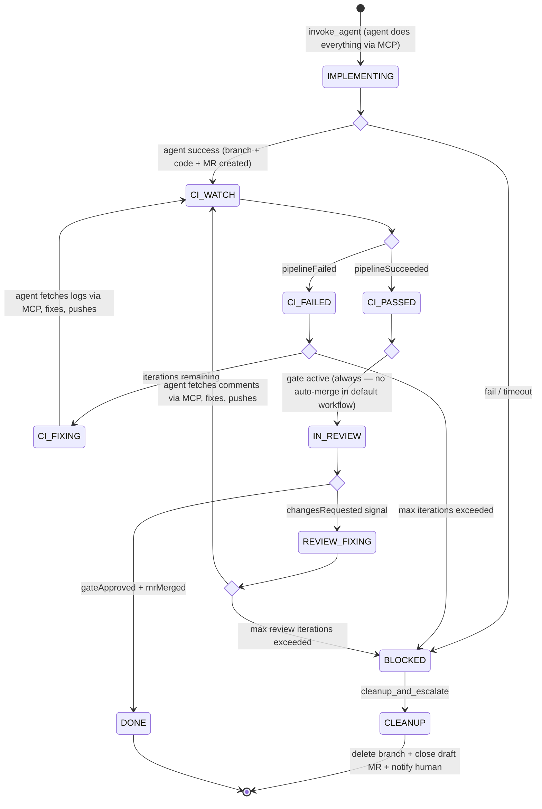
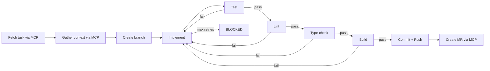
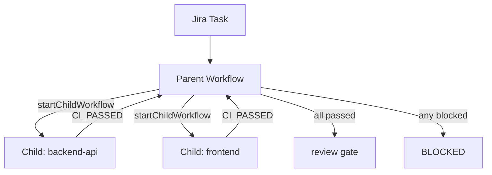

# Workflow Engine

> Part of [AI SDLC Orchestrator](../overview.md) specification

---

## Event System

All external webhooks are normalized into a unified **OrchestratorEvent** and delivered as Temporal Signals or used to start new Workflows.

| Event | Source | Temporal Action |
|---|---|---|
| `task.ready` | Task Tracker | Start new `WorkflowExecution` |
| `task.updated` | Task Tracker | Signal running workflow (`taskUpdated`) |
| `pipeline.success` | CI Provider | Signal (`pipelineSucceeded`) |
| `pipeline.failed` | CI Provider | Signal (`pipelineFailed`) |
| `mr.merged` | VCS | Signal (`mrMerged`) |
| `mr.changes_requested` | VCS | Signal (`changesRequested`) |
| `gate.approved` | Dashboard / API | Signal (`gateApproved`) |

Human gate approvals: `POST /workflows/:id/gates/:gateId/approve` → sends `gateApproved` signal. The Workflow parks at `condition()` until the signal arrives or the timeout elapses.

### Webhook Deduplication & Persistence

Webhooks from external platforms can be delivered multiple times (network retries, platform bugs). The ingress layer handles this at three levels:

1. **Workflow starts** — Temporal natively deduplicates `startWorkflow` calls with the same Workflow ID. The Workflow ID is derived deterministically from `{tenant}-{taskProvider}-{taskId}`, so duplicate `task.ready` webhooks are idempotent.
2. **Signals** — Each webhook carries a platform-specific delivery ID (e.g., Jira `X-Atlassian-Webhook-Identifier`, GitLab `X-Gitlab-Event-UUID`, GitHub `X-GitHub-Delivery`). The webhook handler extracts this ID. Before signaling, the ingress checks the `WEBHOOK_DELIVERY` table for duplicates. Duplicate delivery IDs are acknowledged (200 OK) but not forwarded to the Workflow.
3. **Idempotent signal handlers** — Workflows treat signals idempotently where possible (e.g., receiving `pipelineSucceeded` twice in `CI_PASSED` state is a no-op).

**Webhook persistence:** Every incoming webhook is recorded in the `WEBHOOK_DELIVERY` table (see [Data Model](data-model.md)) with status `processed`, `deduplicated`, or `invalid`. This provides:
- **Debugging** — "why didn't my task trigger?" → query webhook history
- **Audit trail** — full record of external platform interactions
- **Replay** — in case of missed webhooks, replay from the table via admin API
- **Retention:** 30 days, then archived or deleted by a scheduled job

---

## Workflow DSL

Workflows are defined in typed YAML compiled to Temporal Workflow code at startup. The DSL is the stable contract between the definition layer and Temporal.

```yaml
name: default
version: 1

steps:
  - id: implement
    type: auto
    action: invoke_agent            # Agent does everything: fetch task, gather context,
    mode: implement                 # create branch, implement, test, create MR, push
    timeout_minutes: 60
    graceful_shutdown_minutes: 5    # Warn agent at T-5min to wrap up
    on_success: ci_watch
    on_failure: blocked

  - id: ci_watch
    type: signal_wait               # NOT an Activity — Workflow-level condition()
    signal: pipelineSucceeded | pipelineFailed
    timeout_hours: 2
    on_success: review_gate
    on_failure: ci_fix_loop
    on_timeout: blocked

  - id: ci_fix_loop
    type: loop
    action: invoke_agent            # Fresh session — agent gets previousSessionSummary
    mode: ci_fix                    # + prompt to fetch CI logs via MCP, fix, push
    max_iterations: 3
    timeout_minutes: 60
    on_success: ci_watch
    on_exhausted: blocked

  - id: review_gate
    type: gate
    signal: gateApproved | changesRequested
    condition:
      always: true
    timeout_hours: 72
    on_approved: done
    on_changes_requested: review_fix_loop
    on_timeout: blocked
    # No on_skipped — auto-merge without human review is not supported.
    # Tenants who want auto-merge must define a separate workflow DSL
    # with an explicit `auto_merge` step that requires additional
    # safeguards (label filter, max diff size, test coverage threshold).

  - id: review_fix_loop
    type: loop
    action: invoke_agent            # Fresh session — agent gets previousSessionSummary
    mode: review_fix                # + prompt to fetch review comments via MCP, fix, push
    max_iterations: 3
    timeout_minutes: 60
    on_success: ci_watch
    on_exhausted: blocked

  - id: done
    type: terminal
    action: close_workflow

  - id: blocked
    type: terminal
    action: cleanup_and_escalate    # Delete remote branch + close draft MR if no meaningful
                                    # progress was made, then escalate to human
```

The DSL is dramatically simpler — no separate `validate_task`, `enrich_context`, `create_branch`, `open_mr` steps. The agent handles all of these internally via MCP + built-in tools.

> **Note on `invoke_agent` in loops:** Fix loops (`ci_fix_loop`, `review_fix_loop`) use the same `invoke_agent` action with a different `mode` (ci_fix / review_fix). Each invocation is a fresh agent session — the Activity re-clones the repo, checks out the existing branch, and passes `previousSessionSummary` from the last session's `AgentResult.summary`. No session state is persisted or "resumed."

### DSL Concepts

| Concept | Temporal Mapping |
|---|---|
| `auto` step | `workflow.executeActivity(action, options)` — runs a Temporal Activity |
| `signal_wait` step | `condition(() => signalReceived, { timeout })` — Workflow-level, no Activity. Waits for an external signal (webhook) or timeout |
| `gate` step | Same as `signal_wait` but requires explicit human approval (approval signal or timeout) |
| `loop` step | Activity in a `while` loop with counter + cost tracking in Workflow state |
| `terminal` step | Final activity (cleanup / close) + `return` |
| `condition` | Evaluated at runtime to decide if gate is active |

### DSL Versioning & In-Flight Workflow Safety

Temporal requires strict determinism — changing a Workflow definition breaks replay for in-flight executions. The DSL compiler handles this:

1. **Immutable versions** — Each DSL definition has a `version` field. Modifying a workflow creates a new version; existing versions are never mutated.
2. **Version pinning** — When a Workflow starts, it records `dslName + dslVersion` in its state. The compiled Workflow code for that version is loaded at replay time, not the latest version.
3. **Temporal `patched()` for hotfixes** — If a critical fix must apply to in-flight workflows, the compiled code uses Temporal's `patched(patchId)` / `deprecatePatch(patchId)` API to branch behavior based on whether the workflow started before or after the fix.
4. **New workflows use latest active version** — The `is_active` flag on `WORKFLOW_DSL` determines which version new workflows use. Old versions remain available for replay of in-flight workflows.
5. **Drain strategy** — Before deleting an old DSL version, verify no in-flight workflows reference it (query `workflow_mirror` for `current_step_id != terminal` + matching DSL version).

---

## Workflow State Machine



### Agent Inner Loop (Inside IMPLEMENTING)



> **Note:** Push must happen before MR creation — the branch must exist on the remote for the MR to reference it.

The entire inner loop runs within the `invokeAgent` Activity. The agent uses built-in tools (Bash for test/lint/build/git, Read/Write/Edit for code) and MCP servers (for task details, MR creation, context gathering).

---

## Multi-Repo Workflows

Parent spawns child Temporal Workflows per repo. Children run independently. Parent awaits all child handles — Temporal coordinates natively.



**Failure strategy** (configurable per workflow DSL):
- **`wait_all`** (default) — Parent waits for all children to complete regardless of individual failures. If any child is BLOCKED, parent transitions to BLOCKED after all finish. Avoids wasting partial progress.
- **`fail_fast`** — Parent cancels remaining children when the first child fails. Saves cost but loses partial work. The `cleanupBranch` Activity runs for cancelled children to delete orphaned branches.
- The parent Workflow records per-child results in `workflow_mirror.children_status` (JSONB) for dashboard visibility.

**Per-repo concurrency in multi-repo:** Each child workflow targets a different repo, so per-repo concurrency limits (see [Deployment — Configuration](deployment.md)) apply independently. If one repo has a concurrent workflow in progress, that child queues while siblings proceed.
